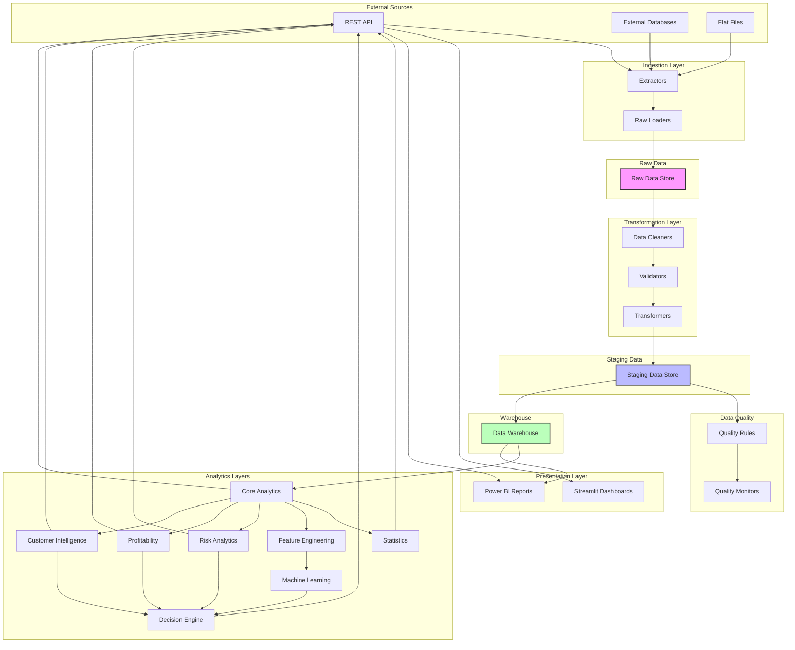

# Architecture Documentation

## Banking Customer Profitability & Risk Analytics Platform

---

## Repository Structure

```
banking-analytics-platform/
├── config/                          # Configuration files
│   ├── base.yaml                   # Base configuration
│   ├── streaming.yaml              # Streaming-specific configuration
│   └── environments/               # Environment-specific configs
│       ├── development.yaml
│       ├── staging.yaml
│       └── production.yaml

├── src/                            # Source code
│   ├── streaming/                  # Streaming infrastructure (CORE)
│   │   ├── processor/              # Event-time processing, watermarks, windows
│   │   ├── schemas/                # Schema registry and validation
│   │   ├── orchestrator/           # Pipeline orchestration
│   │   ├── kafka/                  # Kafka integration (consumer, producer, topics)
│   │   ├── features/               # Streaming feature store (Redis)
│   │   ├── anomaly/                # Anomaly detection
│   │   ├── risk/                   # Real-time risk scoring
│   │   ├── early_warning/          # Early warning system
│   │   ├── alerts/                 # Alert engine
│   │   ├── audit/                  # Decision audit trail
│   │   ├── reconciliation/         # Batch-stream reconciliation
│   │   ├── security/               # Security penetration testing
│   │   ├── data_quality/           # Data quality validation
│   │   ├── chaos/                  # Chaos engineering
│     ├── model_registry/           # Model registry and online inference
│   │   └── config.py               # Streaming configuration
│   │
│   ├── api/                        # FastAPI REST API
│   │   ├── main.py                 # FastAPI application
│   │   ├── middleware.py           # Security headers, correlation ID
│   │   ├── rate_limit.py           # Rate limiting
│   │   ├── auth.py                 # JWT authentication
│   │   ├── customers.py            # Customer endpoints
│   │   ├── profitability.py        # Profitability endpoints
│   │   ├── risk.py                 # Risk endpoints
│   │   ├── segments.py             # Segment endpoints
│   │   ├── churn.py                # Churn endpoints
│   │   └── portfolio.py            # Portfolio endpoints
│   │
│   ├── models/                     # Database models (SQLAlchemy)
│   │   ├── base.py                 # Base model and mixins
│   │   ├── facts.py                # Fact tables (transactions, loans, etc.)
│   │   ├── dimensions.py           # Dimension tables (customer, account, etc.)
│   │   └── __init__.py
│   │
│   ├── feature_engineering/        # Batch feature engineering
│   ├── ml/                         # Machine learning models
│   ├── risk/                       # Risk analytics
│   ├── profitability/              # Profitability analytics
│   └── customer_intelligence/      # Customer 360 analytics

├── streamlit/                      # Streamlit dashboards
│   ├── pages/                      # Dashboard pages
│   └── components/                 # Reusable components

├── tests/                          # Test suite
│   ├── unit/                       # Unit tests
│   ├── integration/                # Integration tests
│   ├── api/                        # API tests
│   ├── security/                   # Security tests
│   └── fixtures/                   # Test fixtures and data

├── sql/                            # SQL scripts
│   ├── migrations/                 # Database migrations (Alembic)
│   ├── schema/                     # Database schema definitions
│   ├── views/                      # Materialized views
│   ├── transaction_analytics.sql   # Transaction analytics queries
│   ├── credit_risk_analytics.sql   # Credit risk analytics queries
│   ├── profitability_analytics.sql # Profitability analytics queries
│   └── customer_360_views.sql      # Customer 360 views

├── k8s/                            # Kubernetes manifests
│   └── production/                 # Production deployment
│       ├── deployment.yaml          # Deployment configuration
│       ├── service.yaml            # Service configuration
│       ├── configmap.yaml          # Configuration
│       └── secret.yaml             # Secrets

├── .github/workflows/               # CI/CD pipelines
│   ├── ci.yml                      # Continuous Integration
│   └── cd.yml                      # Continuous Deployment

├── power_bi/                       # Power BI assets
│   ├── reports/                    # Report definitions
│   └── datasets/                   # Dataset configurations

├── Dockerfile                      # Application container
├── docker-compose.yml              # Development compose
├── requirements.txt                # Python dependencies
├── PROJECT_CONSTITUTION.md         # Project principles
├── ARCHITECTURE.md                 # This file
├── DATA_DICTIONARY.md              # Data dictionary
└── README.md                       # Project overview
```

---

## Module Responsibilities

### Configuration Layer (`config/`)
**Purpose**: Centralized configuration management for all environments.

**Responsibilities**:
- Store environment-specific settings (database connections, API keys, thresholds)
- Define data validation schemas using Pandera
- Manage business logic parameters and rules
- Control feature flags and toggle switches

**Key Files**:
- `base.yaml` - Default configuration values
- `environments/*.yaml` - Environment overrides
- `schemas/*.yaml` - Pandera schema definitions

---

### Data Ingestion Layer (`src/ingestion/`)
**Purpose**: Extract data from external sources and load into raw storage.

**Responsibilities**:
- Connect to external data sources (APIs, databases, files)
- Extract data with proper error handling and retry logic
- Load raw data into `data/raw/` in immutable format
- Log extraction metadata (timestamp, source configuration, record counts)
- Handle incremental vs full load strategies

**Key Modules**:
- `extractors/` - Source-specific extractors (API, Database, File)
- `loaders/` - Raw data loaders
- `orchestrator.py` - Ingestion pipeline orchestration

**Dependencies**: `src/utils/`, `config/`

---

### Data Transformation Layer (`src/transformation/`)
**Purpose**: Clean, validate, and transform raw data into staging format.

**Responsibilities**:
- Apply data cleaning rules (deduplication, normalization)
- Validate data against Pandera schemas
- Perform type conversions and standardization
- Handle missing values and outliers
- Transform data into staging schema
- Maintain data lineage tracking

**Key Modules**:
- `cleaners/` - Data cleaning functions
- `validators/` - Schema validation
- `transformers/` - Business logic transformations
- `lineage.py` - Data lineage tracking

**Dependencies**: `src/ingestion/`, `src/data_quality/`, `config/`

---

### Data Quality Layer (`src/data_quality/`)
**Purpose**: Ensure data quality through validation, monitoring, and alerting.

**Responsibilities**:
- Define and enforce data quality rules
- Monitor data quality metrics (completeness, accuracy, consistency)
- Generate data quality reports
- Alert on quality threshold violations
- Track quality trends over time

**Key Modules**:
- `rules/` - Data quality rule definitions
- `monitors/` - Quality monitoring functions
- `alerts/` - Alerting mechanisms
- `reports/` - Quality report generation

**Dependencies**: `config/`, `src/utils/`

---

### Analytics Layer (`src/analytics/`)
**Purpose**: Core business analytics and metric calculations.

**Responsibilities**:
- Calculate business metrics (KPIs, ratios, aggregations)
- Implement metric definitions from documentation
- Perform time-series analysis
- Generate customer-level and account-level analytics
- Support ad-hoc analytical queries

**Key Modules**:
- `metrics/` - Metric calculation functions
- `aggregations/` - Data aggregation logic
- `time_series/` - Time-series analysis
- `calculator.py` - Unified metric calculator

**Dependencies**: `src/transformation/`, `src/statistics/`, `config/`

---

### Statistics Layer (`src/statistics/`)
**Purpose**: Statistical analysis and hypothesis testing.

**Responsibilities**:
- Perform statistical tests (t-tests, chi-square, ANOVA)
- Calculate confidence intervals and p-values
- Implement correlation and regression analysis
- Support distribution analysis
- Generate statistical reports

**Key Modules**:
- `tests/` - Statistical test implementations
- `distributions/` - Distribution analysis
- `correlation/` - Correlation analysis
- `regression/` - Regression analysis

**Dependencies**: `src/analytics/`, `src/utils/`

---

### Feature Engineering Layer (`src/feature_engineering/`)
**Purpose**: Create predictive features for machine learning models.

**Responsibilities**:
- Design and implement feature transformations
- Create rolling window features
- Generate interaction features
- Handle feature scaling and encoding
- Maintain feature registry and documentation

**Key Modules**:
- `transformers/` - Feature transformation functions
- `windows/` - Rolling window features
- `encoders/` - Encoding and scaling
- `registry.py` - Feature catalog

**Dependencies**: `src/analytics/`, `src/transformation/`, `config/`

---

### Machine Learning Layer (`src/ml/`)
**Purpose**: Train, evaluate, and deploy predictive models.

**Responsibilities**:
- Implement ML models (classification, regression, clustering)
- Train models with proper cross-validation
- Evaluate model performance with relevant metrics
- Handle model versioning and registry
- Support model inference and scoring
- Generate model explainability reports

**Key Modules**:
- `models/` - Model implementations
- `training/` - Training pipelines
- `evaluation/` - Model evaluation metrics
- `registry/` - Model versioning
- `inference/` - Model scoring

**Dependencies**: `src/feature_engineering/`, `src/analytics/`, `config/`

---

### Risk Analytics Layer (`src/risk/`)
**Purpose**: Analyze and quantify banking risks.

**Responsibilities**:
- Calculate credit risk scores
- Assess operational risk exposure
- Perform stress testing scenarios
- Calculate risk-adjusted returns
- Generate risk reports and dashboards

**Key Modules**:
- `credit/` - Credit risk analysis
- `operational/` - Operational risk analysis
- `stress_test/` - Stress testing
- `exposure/` - Risk exposure calculation
- `reports/` - Risk reporting

**Dependencies**: `src/analytics/`, `src/ml/`, `src/statistics/`, `config/`

---

### Profitability Layer (`src/profitability/`)
**Purpose**: Analyze customer and product profitability.

**Responsibilities**:
- Calculate customer-level profitability
- Analyze product and channel profitability
- Perform cost allocation and transfer pricing
- Calculate net interest margins
- Generate profitability reports

**Key Modules**:
- `customer/` - Customer profitability
- `product/` - Product profitability
- `allocation/` - Cost allocation
- `margins/` - Margin analysis
- `reports/` - Profitability reporting

**Dependencies**: `src/analytics/`, `src/transformation/`, `config/`

---

### Customer Intelligence Layer (`src/customer_intelligence/`)
**Purpose**: Comprehensive customer 360 analytics.

**Responsibilities**:
- Build unified customer profiles
- Perform customer segmentation
- Analyze customer journeys and touchpoints
- Calculate customer lifetime value (CLV)
- Analyze churn and retention
- Generate customer insights

**Key Modules**:
- `profiles/` - Customer profile building
- `segmentation/` - Customer segmentation
- `journey/` - Customer journey analysis
- `clv/` - Customer lifetime value
- `churn/` - Churn prediction and analysis
- `insights/` - Customer insight generation

**Dependencies**: `src/analytics/`, `src/ml/`, `src/profitability/`, `src/risk/`, `config/`

---

### Decision Engine Layer (`src/decision_engine/`)
**Purpose**: Decision support systems and recommendation engines.

**Responsibilities**:
- Implement decision rules and logic
- Build recommendation systems
- Support what-if scenario analysis
- Generate decision explanations
- Integrate with business workflows

**Key Modules**:
- `rules/` - Decision rule engine
- `recommendations/` - Recommendation systems
- `scenarios/` - Scenario analysis
- `explanations/` - Decision explainability

**Dependencies**: `src/ml/`, `src/risk/`, `src/profitability/`, `src/customer_intelligence/`, `config/`

---

### API Layer (`src/api/`)
**Purpose**: RESTful API for external system integration.

**Responsibilities**:
- Expose analytics endpoints via FastAPI
- Handle authentication and authorization
- Implement request validation
- Provide API documentation (OpenAPI/Swagger)
- Handle rate limiting and caching
- Log API requests and responses

**Key Modules**:
- `endpoints/` - API endpoint definitions
- `middleware/` - Custom middleware
- `auth/` - Authentication and authorization
- `schemas/` - Pydantic request/response schemas

**Dependencies**: All analytics layers, `src/utils/`, `config/`

---

### Utilities Layer (`src/utils/`)
**Purpose**: Shared utility functions and helpers.

**Responsibilities**:
- Logging configuration and utilities
- Database connection management
- File I/O helpers
- Date/time utilities
- Common data transformations
- Error handling decorators

**Key Modules**:
- `logging.py` - Logging setup
- `database.py` - Database connections
- `files.py` - File operations
- `dates.py` - Date/time utilities
- `decorators.py` - Common decorators

**Dependencies**: None (base layer)

---

### Streamlit Application (`streamlit/`)
**Purpose**: Interactive dashboards for business users.

**Responsibilities**:
- Create interactive visualizations
- Provide parameter-driven analytics
- Support drill-down and filtering
- Generate downloadable reports
- Implement user authentication

**Key Modules**:
- `pages/` - Dashboard pages
- `components/` - Reusable components
- `utils/` - Streamlit utilities

**Dependencies**: `src/api/`, all analytics layers

---

### Tests (`tests/`)
**Purpose**: Comprehensive test coverage.

**Responsibilities**:
- Unit tests for individual functions
- Integration tests for pipelines
- End-to-end tests for critical workflows
- Data validation tests
- Performance tests

**Structure**:
- `unit/` - Unit tests by module
- `integration/` - Integration tests
- `fixtures/` - Test data and fixtures

---

### Documentation (`docs/`)
**Purpose**: Comprehensive project documentation.

**Responsibilities**:
- API documentation
- Metric definitions and formulas
- User guides and tutorials
- Architecture documentation
- Data dictionaries

---

### SQL (`sql/`)
**Purpose**: Database scripts and queries.

**Responsibilities**:
- Database schema migrations
- Stored procedures
- Reusable query templates
- Data warehouse ETL scripts

---

### Power BI (`power_bi/`)
**Purpose**: Executive BI dashboards and reports.

**Responsibilities**:
- Report definitions and layouts
- Dataset configurations
- Visual themes and styling
- Data refresh schedules

---

### Deployment (`deployment/`)
**Purpose**: Deployment and infrastructure configuration.

**Responsibilities**:
- Docker containerization
- Kubernetes orchestration
- CI/CD pipeline configurations
- Infrastructure as code
- Deployment scripts

---

## Data Flow Diagram



---

## Dependency Boundaries

### Layer Hierarchy (Bottom to Top)

```
Level 0: src/utils/
Level 1: config/, src/data_quality/
Level 2: src/ingestion/
Level 3: src/transformation/
Level 4: src/analytics/, src/statistics/
Level 5: src/feature_engineering/
Level 6: src/ml/, src/risk/, src/profitability/, src/customer_intelligence/
Level 7: src/decision_engine/
Level 8: src/api/
Level 9: streamlit/, power_bi/
```

### Dependency Rules

1. **Upward Only**: Modules may only depend on modules at the same or lower levels
2. **No Circular Dependencies**: No module may depend on another that depends on it
3. **Interface Stability**: Lower layers should have stable interfaces to minimize breaking changes
4. **Shared Utilities**: Common functionality goes in `src/utils/` to avoid duplication
5. **Configuration Access**: All modules read from `config/`, but never write to it

### Forbidden Dependencies

- `streamlit/` → `src/ml/` (must go through API)
- `src/risk/` → `src/customer_intelligence/` (risk should be independent)
- `src/profitability/` → `src/risk/` (profitability should be independent)
- `src/api/` → `streamlit/` (API should not depend on UI)

### Allowed Cross-Layer Dependencies

- `src/customer_intelligence/` may use `src/ml/`, `src/risk/`, `src/profitability/`
- `src/decision_engine/` may use all analytics layers
- `src/api/` may use all analytics layers

---

## Naming Conventions

### File Naming

**Python Modules**:
- Use `snake_case`: `customer_profiler.py`, `risk_calculator.py`
- Test files: `test_<module>.py`: `test_customer_profiler.py`
- Private modules: `_<module>.py`: `_utils.py`

**Configuration Files**:
- YAML: `kebab-case.yaml`: `database-config.yaml`
- JSON: `kebab-case.json`: `feature-flags.json`

**SQL Files**:
- Migrations: `YYYYMMDD_description.sql`: `20240101_create_customers_table.sql`
- Procedures: `procedure_name.sql`: `calculate_customer_profitability.sql`

**Documentation**:
- Markdown: `Title-Case.md`: `Customer-Profitability-Guide.md`

### Directory Naming

- Use `snake_case` for directories: `customer_intelligence/`, `feature_engineering/`
- Plural nouns for collections: `tests/`, `migrations/`, `reports/`
- Singular nouns for single-purpose: `config/`, `docs/`

### Code Naming

**Python Classes**:
- Use `PascalCase`: `CustomerProfiler`, `RiskCalculator`, `DataValidator`

**Python Functions**:
- Use `snake_case`: `calculate_profitability`, `validate_schema`, `transform_data`

**Python Variables**:
- Use `snake_case`: `customer_id`, `total_balance`, `risk_score`
- Constants: `UPPER_SNAKE_CASE`: `MAX_RETRY_ATTEMPTS`, `DEFAULT_TIMEOUT`

**Database Tables**:
- Use `snake_case` plural: `customers`, `transactions`, `accounts`
- Junction tables: `table1_table2`: `customer_accounts`

**Database Columns**:
- Use `snake_case`: `customer_id`, `account_balance`, `created_at`

**API Endpoints**:
- Use `kebab-case`: `/api/customers/{id}/profitability`
- Resource names plural: `/api/customers`, `/api/transactions`

### Environment Variables

- Use `UPPER_SNAKE_CASE`: `DATABASE_URL`, `API_KEY`, `LOG_LEVEL`
- Prefix with app name: `BANKING_ANALYTICS_DATABASE_URL`

---

## Configuration Strategy

### Configuration Hierarchy

1. **Base Configuration** (`config/base.yaml`): Default values for all settings
2. **Environment Configuration** (`config/environments/{env}.yaml`): Environment-specific overrides
3. **Runtime Configuration**: Optional runtime overrides (not recommended for production)

### Configuration Loading

```python
import yaml
from pathlib import Path

def load_config(environment: str = "development") -> dict:
    """Load configuration with environment overrides."""
    base_config = yaml.safe_load(Path("config/base.yaml").read_text())
    env_config = yaml.safe_load(Path(f"config/environments/{environment}.yaml").read_text())
    
    # Deep merge environment config into base config
    return deep_merge(base_config, env_config)
```

### Configuration Structure

```yaml
# config/base.yaml
database:
  host: localhost
  port: 5432
  name: banking_analytics
  pool_size: 10

api:
  host: 0.0.0.0
  port: 8000
  workers: 4

logging:
  level: INFO
  format: json
  path: logs/

analytics:
  risk_thresholds:
    low: 0.3
    medium: 0.6
    high: 0.8
  
  profitability:
    cost_allocation_method: activity_based
```

### Schema Validation Configuration

```yaml
# config/schemas/customer_schema.yaml
type: dataframe
columns:
  customer_id:
    dtype: int64
    nullable: false
    unique: true
  name:
    dtype: string
    nullable: false
  birth_date:
    dtype: datetime64[ns]
    nullable: false
```

### Feature Flags

```yaml
# config/feature_flags.yaml
features:
  advanced_risk_modeling: true
  real_time_scoring: false
  experimental_segmentation: true
```

### Configuration Best Practices

1. **Never hardcode values**: All configurable values must be in config files
2. **Secrets management**: Never commit secrets; use environment variables or secret managers
3. **Validation**: Validate configuration at startup
4. **Documentation**: Document all configuration options
5. **Version control**: Track configuration changes in git
6. **Environment parity**: Keep environment configs as similar as possible

---

## Logging Strategy

### Logging Levels

- **DEBUG**: Detailed diagnostic information for development
- **INFO**: General informational messages about pipeline progress
- **WARNING**: Warning messages for unexpected but recoverable issues
- **ERROR**: Error messages for failures that don't stop execution
- **CRITICAL**: Critical errors that require immediate attention

### Logging Structure

```python
import logging
import structlog
from pathlib import Path

def setup_logging(config: dict) -> None:
    """Configure structured logging."""
    log_path = Path(config["logging"]["path"])
    log_path.mkdir(parents=True, exist_ok=True)
    
    structlog.configure(
        processors=[
            structlog.stdlib.filter_by_level,
            structlog.stdlib.add_logger_name,
            structlog.stdlib.add_log_level,
            structlog.stdlib.PositionalArgumentsFormatter(),
            structlog.processors.TimeStamper(fmt="iso"),
            structlog.processors.StackInfoRenderer(),
            structlog.processors.format_exc_info,
            structlog.processors.JSONRenderer()
        ],
        context_class=dict,
        logger_factory=structlog.stdlib.LoggerFactory(),
        cache_logger_on_first_use=True,
    )
```

### Log Format

```json
{
  "event": "Data ingestion completed",
  "level": "info",
  "timestamp": "2024-01-01T12:00:00Z",
  "logger": "src.ingestion.extractors",
  "source": "customer_api",
  "records_extracted": 1000,
  "duration_seconds": 5.2
}
```

### Logging by Module

**Ingestion Layer**:
- Log source connection status
- Log record counts extracted
- Log extraction duration
- Log any failures with retry attempts

**Transformation Layer**:
- Log validation results (pass/fail counts)
- Log transformation rules applied
- Log data quality issues
- Log lineage metadata

**Analytics Layers**:
- Log metric calculations
- Log model training progress
- Log scoring operations
- Log performance metrics

**API Layer**:
- Log all requests with method, path, and duration
- Log authentication events
- Log rate limiting events
- Log errors with stack traces

### Log Rotation

- Daily log files
- Retain 30 days of logs
- Compress logs older than 7 days
- Archive critical logs separately

### Sensitive Data

- **Never log PII**: Mask or redact personal information
- **Never log secrets**: Never log API keys, passwords, or tokens
- **Hash identifiers**: Use hashed customer IDs in logs when needed

### Monitoring and Alerting

- **CRITICAL logs**: Trigger immediate alerts
- **ERROR logs**: Aggregate and alert on thresholds
- **Performance logs**: Monitor for degradation
- **Audit logs**: Retain for compliance

---

## Testing Strategy

### Test Pyramid

```
        /\
       /E2E\        (10% - Critical workflows)
      /------\
     /Integration\  (30% - Pipeline integration)
    /------------\
   /   Unit Tests \  (60% - Individual functions)
  /----------------\
```

### Unit Tests

**Purpose**: Test individual functions and classes in isolation.

**Coverage Target**: 80%+ for all core modules.

**Tools**: pytest, pytest-cov, pytest-mock.

**Examples**:
- Test metric calculations with known inputs
- Test data validation rules
- Test transformation logic
- Test statistical functions

```python
# tests/unit/analytics/test_profitability.py
def test_calculate_customer_profitability():
    """Test customer profitability calculation."""
    customer_data = {
        "customer_id": 1,
        "revenue": 1000.0,
        "costs": 400.0
    }
    
    result = calculate_profitability(customer_data)
    
    assert result == 600.0
    assert isinstance(result, float)
```

### Integration Tests

**Purpose**: Test interactions between modules and components.

**Coverage Target**: All critical data pipelines and API endpoints.

**Tools**: pytest, testcontainers (for database), pytest-asyncio.

**Examples**:
- Test full ingestion pipeline
- Test transformation pipeline with real data
- Test API endpoints with database
- Test ML model training pipeline

```python
# tests/integration/test_ingestion_pipeline.py
def test_full_ingestion_pipeline(test_database):
    """Test complete ingestion pipeline."""
    # Ingest data
    ingest_customer_data(source="test_api")
    
    # Verify raw data exists
    assert raw_data_exists("customers")
    
    # Verify staging data exists
    assert staging_data_exists("customers")
    
    # Verify data quality
    assert data_quality_passes("customers")
```

### End-to-End Tests

**Purpose**: Test critical user workflows from start to finish.

**Coverage Target**: 5-10 critical business workflows.

**Tools**: pytest, Playwright (for UI), requests (for API).

**Examples**:
- Test customer profitability report generation
- Test risk assessment workflow
- Test churn prediction pipeline
- Test API request to dashboard display

### Test Data Management

**Fixtures**: Use pytest fixtures for reusable test data.

**Synthetic Data**: Generate synthetic test data, never use real PII.

**Data Reset**: Reset database state between tests.

**Test Databases**: Use separate test databases, never production.

### Performance Tests

**Purpose**: Ensure system meets performance requirements.

**Tools**: pytest-benchmark, locust.

**Metrics**:
- API response times (< 200ms for p95)
- Pipeline execution times
- Database query performance
- Model inference latency

### Data Validation Tests

**Purpose**: Ensure data quality throughout pipelines.

**Tests**:
- Schema validation
- Completeness checks
- Uniqueness checks
- Range checks
- Referential integrity

### Test Organization

```
tests/
├── unit/
│   ├── analytics/
│   ├── ingestion/
│   ├── transformation/
│   └── ...
├── integration/
│   ├── pipelines/
│   ├── api/
│   └── database/
├── e2e/
│   ├── workflows/
│   └── ui/
├── fixtures/
│   ├── data/
│   └── schemas/
└── conftest.py
```

### Continuous Integration

- Run all tests on every commit
- Fail build if test coverage drops below threshold
- Run performance tests nightly
- Generate coverage reports

### Test Best Practices

1. **Independent tests**: Each test should run independently
2. **Descriptive names**: Test names should describe what they test
3. **Arrange-Act-Assert**: Structure tests clearly
4. **Mock external dependencies**: Don't depend on external services
5. **Test edge cases**: Test boundary conditions and error cases
6. **Maintain tests**: Keep tests updated with code changes

---

## Summary

This architecture provides:

- **Clear separation of concerns** with well-defined module boundaries
- **Scalable data pipelines** from ingestion to presentation
- **Configuration-driven behavior** for flexibility
- **Strong data quality** through validation and monitoring
- **Comprehensive testing** at multiple levels
- **Production-ready** logging and monitoring
- **Modular design** for maintainability and extensibility

All principles from the PROJECT_CONSTITUTION are reflected in this architecture.
