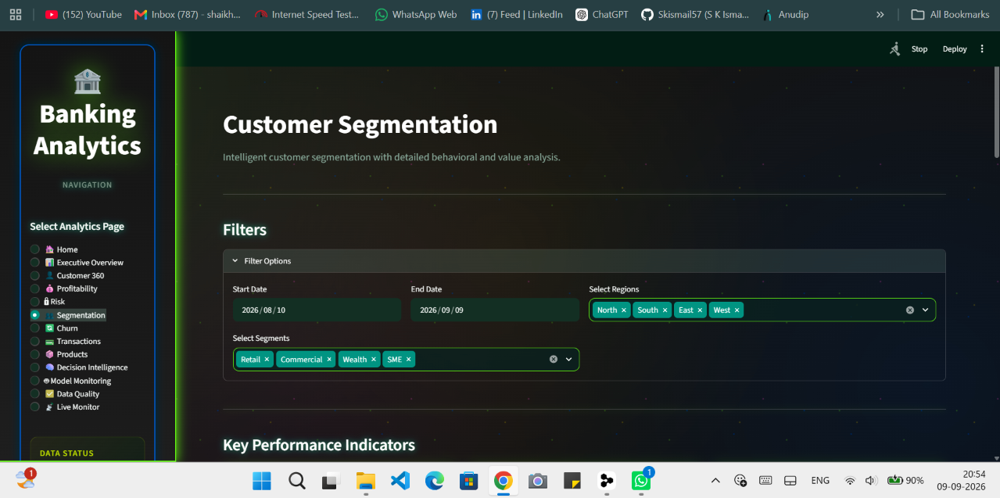

# Banking Customer Profitability and Risk Analytics Platform

<div align="center">

[](#)
[](#)
[](#)

[](#)
[](#)
[](#)

</div>


> A modular, domain-driven banking analytics platform that unifies customer profitability measurement, credit risk scoring, churn prediction, customer segmentation, real-time transaction monitoring, executive decision intelligence, and model observability into one cohesive FastAPI + Streamlit + PostgreSQL data warehouse application.


---

## 📑 Table of Contents

| # | Section | # | Section |
|---|---------|---|---------|
| 1 | [📋 Project Overview](#1-project-overview) | 21 | [🔐 Environment Variables](#21-environment-variables) |
| 2 | [🚀 Quick Start](#2-quick-start) | 22 | [💾 Database Setup](#22-database-setup) |
| 3 | [📈 Platform at a Glance](#3-platform-at-a-glance) | 23 | [▶️ Running the Backend](#23-running-the-backend) |
| 4 | [💡 Why This Project Matters](#4-why-this-project-matters) | 24 | [🖥️ Running the Frontend](#24-running-the-frontend) |
| 5 | [⚡ Key Capabilities](#5-key-capabilities) | 25 | [🐳 Docker Setup](#25-docker-setup) |
| 6 | [🎯 Business Problem](#6-business-problem) | 26 | [🧪 Testing](#26-testing) |
| 7 | [✅ Solution](#7-solution) | 27 | [🔍 Code Quality](#27-code-quality) |
| 8 | [⭐ Key Highlights](#8-key-highlights) | 28 | [🔄 CI/CD](#28-cicd) |
| 9 | [🔧 Features](#9-features) | 29 | [🚀 Deployment](#29-deployment) |
| 10 | [🏗️ Architecture](#10-architecture) | 30 | [🔒 Security](#30-security) |
| 11 | [📸 Project Screenshots](#11-project-screenshots) | 31 | [⚡ Performance & Scalability](#31-performance--scalability) |
| 12 | [🛠️ Technology Stack](#12-technology-stack) | 32 | [✨ Advantages](#32-advantages) |
| 13 | [📁 Project Structure](#13-project-structure) | 33 | [💼 Use Cases](#33-use-cases) |
| 14 | [🗄️ Data Architecture](#14-data-architecture) | 34 | [🔧 Troubleshooting](#34-troubleshooting) |
| 15 | [💾 Database](#15-database) | 35 | [🚀 Future Enhancements](#35-future-enhancements) |
| 16 | [📊 Analytics](#16-analytics) | 36 | [🤝 Contributing](#36-contributing) |
| 17 | [✅ Data Quality](#17-data-quality) | 37 | [📊 Project Status](#37-project-status) |
| 18 | [📚 API Documentation](#18-api-documentation) | 38 | [🔗 Repository Resources](#38-repository-resources) |
| 19 | [📦 Installation](#19-installation) | 39 | [📄 License](#39-license) |
| 20 | [⚙️ Prerequisites](#20-prerequisites) | | |

---

## 1. Project Overview

The **Banking Customer Profitability and Risk Analytics Platform** is a modular, domain-driven data analytics application built for retail and SME banking teams. It ingests, validates, models, and visualizes every layer of a bank's customer relationship lifecycle — from origination and product holding through daily transactions, lending exposure, fee income, operating costs, credit delinquency, churn signals, fraud suspicion, and executive-level decision intelligence.

The platform provides:

- A **FastAPI** REST and WebSocket backend exposing analytics, monitoring, health, and real-time routes
- A **Streamlit** interactive analytics frontend with 14 themed dashboards
- A **PostgreSQL 15** data warehouse with star-schema dimensional models (4 dimensions, 9 fact tables) and 10 pre-built analytical SQL views
- A **Pandera-based data-quality layer** with schema contracts and business-rule validators
- A **Kafka + Redis** streaming tier for real-time alerts, anomaly detection, and feature-serving materialization

### 1.1 Project Identity

| Item | Value |
|------|-------|
| Official Name | Banking Customer Profitability and Risk Analytics Platform |
| Short Name | Banking Analytics Platform |
| Primary Audience | Retail / SME Banking — CFO, CRO, Head of Retail, Analytics Office |
| Data Model Class | Star-schema, banking customer analytics (Kimball-style) |
| Deployment Tier | Self-hosted (Postgres + FastAPI + Streamlit + Kafka/Redis) or Kubernetes |

---

## 2. Quick Start

### 2.1 Docker (Recommended)

```bash
# Clone the repository
git clone https://github.com/Skismail57/Banking-Customer-Profitability-and-Risk-Analytics-Platform.git
cd Banking-Customer-Profitability-and-Risk-Analytics-Platform

# Copy environment file
cp .env.example .env
# Edit .env with your configuration (at minimum DB_PASSWORD)

# Start all services
docker compose up -d --build
```

#### Access URLs

| Service | URL |
|---------|-----|
| Streamlit Dashboard | http://localhost:8501 |
| FastAPI | http://localhost:8000 |
| Swagger UI | http://localhost:8000/docs |
| Redoc | http://localhost:8000/redoc |

### 2.2 Local Python

See [Installation](#19-installation) section for detailed local setup instructions.

---

## 3. Platform at a Glance

| Metric | Value |
|---|---:|
| Streamlit Dashboards | 14 |
| FastAPI Router Modules | 10 |
| Pandera Schemas | Data quality contracts |
| Analytical SQL Views | 10 |
| Fact Tables | 9 |
| Dimension Tables | 4 |
| Test Files | 35 |
| Docker Images | 3 |
| Dashboard Screenshots | 64 |
| Cover Image | 1 |
| Total Screenshots | 65 |

---

## 4. Why This Project Matters

This project demonstrates the design and implementation of a production-oriented banking analytics platform combining:

- **Data Engineering** — ETL pipelines, star-schema dimensional modeling, data quality validation
- **SQL Analytics** — Analytical views, complex aggregations, performance optimization
- **Machine Learning** — Churn prediction, customer segmentation, risk scoring models
- **Risk Analytics** — Credit risk assessment, exposure analysis, early warning systems
- **Business Intelligence** — Executive dashboards, decision intelligence, KPI tracking
- **REST APIs** — FastAPI backend with OpenAPI documentation, JWT authentication
- **Real-Time Streaming** — Kafka event bus, Redis feature store, live alert monitoring
- **Data Quality Engineering** — Pandera schema validation, business rule enforcement
- **MLOps / Model Monitoring** — Model performance tracking, drift detection
- **Docker and Kubernetes** — Containerization, orchestration, deployment automation
- **CI/CD** — Automated testing, quality gates, deployment pipelines

---

## 5. Key Capabilities

| Capability | Technology | Business Value |
|---|---|---|
| Customer 360 | FastAPI + PostgreSQL | Unified customer intelligence across all touchpoints |
| Profitability | SQL + Python | Customer-level profit analysis with cost allocation |
| Credit Risk | ML + Analytics | Risk scoring, exposure analysis, delinquency prediction |
| Churn | Scikit-learn | Retention prioritization with probability scoring |
| Segmentation | KMeans/HDBSCAN | Customer targeting with behavioral clustering |
| Fraud Monitoring | Kafka + Redis | Real-time anomaly detection and alerting |
| Decision Intelligence | Analytics Engine | Executive recommendations for strategic actions |
| Model Monitoring | Python + SQL | Model performance tracking and drift detection |
| Data Quality | Pandera | Automated validation with business rule enforcement |
| Real-Time Alerts | WebSocket + Streaming | Live monitoring with severity-tiered notifications |

---

## 6. Business Problem

Banking leadership teams typically operate with fragmented, Excel-based reporting across risk, finance, marketing, and operations silos. The consequences are costly:

1. **Profitability opacity.** No single source of truth for *customer-level* net profit after funds-transfer-pricing (FTP), cost-to-serve, risk costs, and capital charges.
2. **Risk blind spots.** Credit, fraud, and early-warning signals are computed on disjoint schedules; by the time a delinquency is reported, the loss is already realized.
3. **Churn discovered too late.** Attrition analytics remain descriptive rather than predictive.
4. **No feedback loop.** Models in production drift silently without automated monitoring.
5. **Data quality debt.** Hand-written ETL silently accepts invalid business data (fraud scores > 1, future-dated originations, zero-amount transactions, negative credit limits), corrupting every downstream report.

The platform solves this by unifying these concerns under one versioned, testable, observable codebase with schema-enforced contracts at every ingestion boundary.

---

## 7. Solution

The platform delivers a **single cohesive analytics product** covering the full decision stack:

```
 ┌────────────────────────────────────────────────────────────────────┐
 │                      Streamlit Frontend (14 Pages)                 │
 │  Home  Executive  Customer360  Profitability  Risk  Churn  Segments │
 │  Products  Transactions  Decision  DQ  Models  Live Monitor        │
 └────────────────────────────┬───────────────────────────────────────┘
                              │ HTTP / HTTPS
 ┌────────────────────────────▼───────────────────────────────────────┐
 │                      FastAPI Backend (10+ Routes)                  │
 │   Health  Auth  Customers  Profitability  Risk  Churn  Segments    │
 │   Portfolio  Realtime(WSS)  Recommendations  OpenAPI/Redoc/Swagger │
 └──────────────────────┬───────────────────────────┬─────────────────┘
                        │ SQLAlchemy 2.x            │ WebSocket + Kafka
 ┌──────────────────────▼─────────────────────┐  ┌─▼──────────────────────┐
 │         PostgreSQL 15 Data Warehouse       │  │ Redis + Kafka Streaming │
 │  4 Dims · 9 Facts · 10 Analytical Views    │  │  Feature Store · Alerts │
 └────────────────────────────────────────────┘  └────────────────────────┘
```

Key differentiators:

- **Pandera schema contracts on every table.** No data ever enters the warehouse without passing a strict validation report that includes per-column range checks, cross-field date ordering, non-negativity on financial fields, and domain-specific interval rules (e.g., `0 ≤ fraud_score ≤ 1`, `300 ≤ credit_score ≤ 850`, `maturity_date ≥ origination_date`, `amount ≠ 0`).
- **Analytics modules in a consistent orchestrator pattern.** Each domain (`profitability`, `credit_risk`, `churn`, `clv`, `customer_segmentation`, `customer_intelligence`, `advanced_risk_analytics`, `behavioral`, `core_analytics`, `data_governance`) exposes the same `base.py → features/models → orchestrator.py` shape for predictable extension.
- **Real-time streaming.** An independent `streaming/` module integrates Kafka (event bus) and Redis (feature store / live alert cache) with a live-monitor dashboard visualizing severity-tiered alerts (Critical / High / Medium / Low).

---

## 8. Key Highlights

- ✅ **35 test files** covering units, API contracts, and end-to-end analytics pipelines.
- ✅ **Pandera schemas** with business-rule validators on every column.
- ✅ **4 financial star-schema dimensions** and **9 fact tables** covering the full customer relationship.
- ✅ **10 pre-built analytical SQL views** (executive KPI, customer 360, profitability trend, risk distribution, churn retention, segment analysis, product analytics, transaction analytics, decision intelligence, model monitoring).
- ✅ **3 Docker images** (FastAPI API, Streamlit UI, Streaming worker) with a 4-service compose topology plus an optional pipeline and Kafka/Redis overlay.
- ✅ **14 Streamlit dashboards** with 64 dashboard screenshots captured and documented.
- ✅ **OpenAPI 3.1 / Swagger UI / Redoc** interactive API documentation endpoints.
- ✅ **JWT-based authentication** in the API with secure dependencies and schema-level rate limiting.

---

## 9. Features

### 9.1 Executive & Strategic
- **Executive Overview** — aggregate KPIs, region/segment filters, revenue trend, risk distribution, and prioritized recommendation feed.
- **Decision Intelligence** — profitability/risk/growth action items, KPI overview panel, filterable recommendation engine.

### 9.2 Customer Intelligence
- **Customer 360** — individual customer search, profile, metrics cards (Revenue / Net Profit / Risk Score / CLV), Risk Information pane, Revenue-vs-Profit and Risk-vs-CLV charts, and recent transactions table.
- **Customer Segmentation** — unsupervised clustering + rule-based segments, KPI cards, segment data table, average balance / distribution / revenue charts.
- **Churn Analytics** — churn KPI cards (High Churn Risk / Avg Churn Probability / Total Customers), churn risk & probability distributions, prediction table, filtered high-risk cohort view.

### 9.3 Financial & Risk
- **Profitability Analytics** — customer-level profitability KPIs, revenue/profit distribution charts, full profitability metrics table.
- **Credit Risk Analytics** — risk KPI cards (High Risk Count / Avg Score / Total Exposure), risk score bands, exposure charts, detailed delinquency table.
- **Advanced Risk** — concentration analysis, delinquency buckets, early-warning signals, exposure concentration, RAROC (risk-adjusted profitability), risk migration, transition matrices, trend monitoring.
- **CLV Analytics** — historical CLV, estimated CLV, predicted CLV, adjustments, sensitivity analysis.

### 9.4 Product & Transaction
- **Product Analytics** — header/filters, KPIs, product performance breakdown, Average Balance view, NPL Rate view, Total Revenue / Customer distribution charts.
- **Transaction Analytics** — header/description/filters, KPI cards, Recent Transactions table, Volume by Type & Product bar charts.

### 9.5 Operations & Observability
- **Data Quality Monitoring** — live dashboard with validation metrics table.
- **Model Monitoring** — model KPI summary cards, configuration panel, performance metrics table.
- **Live Monitor / Real-Time Streaming** — real-time streaming analytics & metrics, account anomalies, risk-threshold exceedances, payment failures (Critical / High / Medium / Low severity), suspicious activity alerts, recent alerts feed.

### 9.6 Backend & Platform
- REST API with 10+ router modules (health, auth, customers, profitability, risk, churn, segments, portfolio, realtime WebSocket, recommendations).
- **Swagger UI**, **Redoc**, and raw **OpenAPI 3.1 JSON** auto-documentation.
- **Pandera data-quality layer** with per-column + cross-field validators.
- **Rate limiting**, **audit middleware**, and **structured JWT auth dependencies**.
- **Alembic migrations**, **SQL scripts**, and **PostgreSQL views** for every analytical domain.

---

## 10. Architecture

The platform follows a **layered, domain-driven architecture** with clear ownership boundaries:

### 10.1 Layered Model

```
┌───────────────────────────────────────────────────────────────────┐
│ L1  Presentation           Streamlit (14 pages / component mods) │
├───────────────────────────────────────────────────────────────────┤
│ L2  Interface/API          FastAPI routes · Pydantic schemas      │
│                            REST + WebSocket + OpenAPI docs        │
├───────────────────────────────────────────────────────────────────┤
│ L3  Application/Orchestrators 10 analytics modules                │
│           profitability · credit_risk · churn · clv · segments    │
│           customer_intelligence · advanced_risk · behavioral      │
│           core_analytics · data_governance                        │
├───────────────────────────────────────────────────────────────────┤
│ L4  Domain / Data Quality   Pandera schemas · contracts          │
│                            BaseSchema + field validators          │
│                            + cross-field validators               │
├───────────────────────────────────────────────────────────────────┤
│ L5  Infrastructure         SQLAlchemy 2.x ORM · PostgreSQL 15     │
│                            Redis · Kafka · Alembic · Docker       │
└───────────────────────────────────────────────────────────────────┘
```

### 10.2 Data Flow

1. **Batch or streaming input** → Pandera `BaseSchema.validate_with_report()`
2. **Validation pass** → Pandas DataFrame with type coercion + nullable column auto-injection
3. **Validation fail** → Report DataFrame returned with per-rule failures; no write
4. **Validated data** → `SQLAlchemy` write into star schema
5. **Analytical SQL views** maintained in `sql/views/` and materialized on demand
6. **API layer** reads via SQLAlchemy, serializes via Pydantic, returns JSON
7. **Frontend layer** composes Plotly charts / KPI cards / tables from API
8. **Streaming layer** writes alerts into Redis + Kafka; Live Monitor page subscribes via WebSocket

### 10.3 Key Architectural Choices

| Concern | Choice | Rationale |
|---------|--------|-----------|
| ORM | SQLAlchemy 2.x (type-safe queries) | Mature, type-aware, Alembic migrations native. |
| Schema validation | Pandera 0.18 + custom validators dispatch layer | Explicit registries preserve every business rule. |
| Missing nullable columns in strict mode | Auto-injects NaN for `nullable=True` cols before validation | Lets legitimately-optional dates be absent from input DataFrames. |
| API transport | FastAPI (REST) + Starlette WebSocket | REST for domain endpoints, WSS for live streaming alert fan-out. |
| Auth | JWT via `passlib` + `bcrypt` + dependency injection | Stateless bearer tokens without tight coupling. |
| Frontend | Streamlit 1.x multi-page app | Fastest path from DataFrame to dashboard; supports Plotly, pandas-native rendering. |

---

## 11. Project Screenshots

### 11.1 Dashboard Index

| # | Dashboard | Focus |
|---|-----------|-------|
| 1 | Home | Platform overview |
| 2 | Executive Overview | KPIs & recommendations |
| 3 | Customer 360 | Customer intelligence |
| 4 | Profitability | Revenue & profit |
| 5 | Credit Risk | Risk & exposure |
| 6 | Churn | Retention analytics |
| 7 | Segmentation | Customer segments |
| 8 | Product Analytics | Product performance |
| 9 | Transaction Analytics | Transaction intelligence |
| 10 | Decision Intelligence | Executive actions |
| 11 | Data Quality | Data validation |
| 12 | Model Monitoring | ML observability |
| 13 | Live Monitor | Real-time alerts |
| 14 | API Documentation | Swagger/Redoc |

### 11.2 Screenshot Count
- **Dashboard Screenshots**: 64
- **Cover Image**: 1
- **Total**: 65 PNG files

### 11.3 Screenshot Gallery

#### 11.3.1 Home / Platform Overview


*Welcome screen — platform mission statement, core capabilities overview, and entry-point navigation.*

..png)

*Getting Started guide plus Platform Statistics KPI cards.*


*Quick Navigation panel plus high-level Data Source architecture.*

#### 11.3.2 Executive Overview Dashboard

%20and%20top%20recommendations.png)

*Executive Overview headline KPI row and prioritized top recommendations feed.*


*Date-range picker, Region multi-select, and Segment multi-select filters.*


*Revenue-by-Customer line chart alongside Risk-Score-by-Level bar chart.*

..png)

*Expanded Executive Recommendations panel with categorized action items.*


*Customer Metrics Summary data table view.*


*Browser print-preview dialog exporting the Executive Overview dashboard to PDF.*


*Streamlit's built-in "Record a screencast" overlay.*

#### 11.3.3 Customer 360 Profile

..png)

*Customer search bar and initial profile header.*

%20and%20Risk%20Information..png)

*Customer metrics cards paired with Risk Information pane.*


*Quadrant view combining Revenue-vs-Profit and Risk-vs-CLV.*


*Risk Information pane plus Recent Transactions table.*

#### 11.3.4 Profitability Analytics


*Profitability Analytics page header and filter controls.*

.png)

*Profitability KPI cards.*


*Two distribution charts showing customer-level Revenue and Profit spreads.*


*Customer Profitability Metrics Data Table.*

#### 11.3.5 Credit Risk Analytics


*Credit Risk Analytics header with filter selection panel.*

.png)

*Credit Risk KPI cards.*


*Risk Score by Level distribution plus Exposure chart.*


*Detailed Risk Analysis and Delinquency Table.*

#### 11.3.6 Churn Analytics


*Churn Analytics page header and filter options.*

.png)

*Churn KPI cards.*


*Churn Risk distribution and Churn Probability distribution charts.*


*Churn Predictions table.*


*Filtered High Churn Risk Customers table.*

#### 11.3.7 Customer Segmentation



*Segmentation filters UI.*

.png)

*Segmentation KPI cards.*


*Customer Segments data table.*


*Average Balance by Segment bar chart.*


*Dual bar charts: customer Distribution by Segment and Revenue by Segment.*

#### 11.3.8 Product Analytics


*Product Analytics page header and product/segment filter controls.*


*Expanded filters layout plus Product Analytics Key Performance Indicators.*


*Product KPIs directly above the Product Performance breakdown table.*


*Average Balance view by product.*

%20Rate%20chart%20view.png)

*Non-Performing Loan (NPL) Rate chart view by product.*


*Dual charts: Total Revenue by product and Customer Distribution by product.*

#### 11.3.9 Transaction Analytics


*Transaction Analytics page header, description, and filter controls.*

.png)

*Transaction Analytics KPI cards.*


*Recent Transactions data table with pagination and filters.*


*Volume by Type bar chart and Volume by Product bar chart.*

#### 11.3.10 Decision Intelligence


*Decision Intelligence page header and filter controls.*


*Decision Intelligence KPI Metrics Overview.*


*Executive Recommendations list.*

#### 11.3.11 Data Quality Monitoring


*Data Quality Monitoring dashboard and Metrics Table.*

#### 11.3.12 Model Monitoring


*Model Monitoring header plus Configuration pane.*


*Model Monitoring KPI Summary Cards.*


*Model Monitoring Performance Metrics Table.*

#### 11.3.13 Live Monitor / Real-Time Streaming Analytics


*Live Monitor streaming overview header and metrics.*


*Payment Failure and Account Anomaly alert streams.*

.png)

*Recent Alerts Feed view prioritized for High and Medium severity.*

%20and%20High%20Transaction%20Volume%20(Medium)%20alerts..png)

*Account Anomaly alerts spanning Low and High severity alongside High Transaction Volume alert.*

%20and%20Payment%20Failure%20alerts..png)

*Risk Threshold Exceeded alerts interspersed with Payment Failure events.*

%20and%20Suspicious%20Activity%20(Critical)%20alerts..png)

*Critical severity tile view highlighting Payment Failure and Suspicious Activity events.*

%2C%20Payment%20Failure%20(Low)%2C%20and%20Suspicious%20Activity%20alerts..png)

*Low-severity alert view for tracking/audit.*

%20alerts..png)

*Medium-severity aggregation view.*

#### 11.3.14 API & Backend Documentation


*JSON response from the root API endpoint exposing HATEOAS-style link collection.*

%2C%20version%2C%20and%20database%20state..png)

*JSON response from the health endpoint.*


*Raw `openapi.json` response.*


*Swagger UI page with OpenAPI 3.1 banner and endpoint list.*


*Top-level Redoc UI.*


*Redoc UI detail view showing sample request/response bodies.*

#### 11.3.15 Miscellaneous UI Artifact


*Browser share-screen prompt triggered when starting the Streamlit screencast recorder.*

---

## 🛠️ Technology Stack
## 🛠️ Technology Stack

The platform is built with a modern data engineering, analytics, machine learning, API, security, and deployment stack.

<p align="center">
  
</p>

### 🎨 Frontend

| Icon | Technology | Version | Purpose |
|---|---|---:|---|
| 📊 | **Streamlit** | 1.31.0 | Used to build interactive banking analytics dashboards |
| 📈 | **Plotly** | 5.18.0 | Used to create interactive charts and risk/profitability visualizations |

---

### ⚙️ Backend

| Icon | Technology | Version | Purpose |
|---|---|---:|---|
| 🐍 | **Python** | 3.11+ | Used for backend development, data processing, analytics, and machine learning |
| ⚡ | **FastAPI** | 0.109.0 | Used to build REST APIs for serving banking analytics and application services |
| � | **python-jose** | 3.3.0 | Used for JWT authentication and token management |
| 🔑 | **Passlib** | 1.7.4 | Used for password hashing |
| 🔒 | **bcrypt** | 4.0.1 | Used for secure password hashing |
| 🚦 | **SlowAPI** | 0.1.9 | Used for API rate limiting and abuse protection |

---

### 🗄️ Database

| Icon | Technology | Version | Purpose |
|---|---|---:|---|
| 🐘 | **PostgreSQL** | 15 | Used to store customer, account, transaction, profitability, and risk data |
| � | **SQLAlchemy** | 2.0.35 | Used for database access and ORM operations |
| 🔄 | **Alembic** | 1.13.0 | Used for database schema migrations |
| � | **psycopg2-binary** | 2.9.9 | Used to connect Python applications to PostgreSQL |

**Data Architecture:** PostgreSQL star schema with **4 dimensions, 9 fact tables, and 10 analytical SQL views**.

---

### 📊 Data Engineering & Data Quality

| Icon | Technology | Version | Purpose |
|---|---|---:|---|
| 🐼 | **Pandas** | 2.1.4 | Used for data cleaning, transformation, aggregation, and analysis |
| 🚀 | **Polars** | 0.20.6 | Used for high-performance DataFrame processing |
| 🔢 | **NumPy** | 1.26.2 | Used for numerical calculations and data processing |
| 🛡️ | **Pandera** | 0.18.0 | Used to validate data schemas and detect data-quality problems |

---

### 🤖 Machine Learning & Statistics

| Icon | Technology | Version | Purpose |
|---|---|---:|---|
| 🤖 | **Scikit-learn** | 1.3.2 | Used for customer segmentation, prediction, classification, and clustering |
| ⚖️ | **Imbalanced-learn** | 0.11.0 | Used to handle imbalanced machine learning datasets |
| 🧮 | **SciPy** | 1.11.4 | Used for scientific computing and statistical calculations |
| � | **Statsmodels** | 0.14.0 | Used for statistical modelling and analytical methods |

---

### 🔄 Real-Time Streaming & Caching

| Icon | Technology | Version | Purpose |
|---|---|---:|---|
| 📨 | **Apache Kafka** | — | Used for real-time transaction and event streaming |
| � | **Confluent Kafka** | 2.0.2 | Used to integrate Python applications with Kafka producers and consumers |
| �🔴 | **Redis** | 4.3.4 | Used for caching, feature serving, and live-alert state management |

---

### 🧪 Testing

| Icon | Technology | Version | Purpose |
|---|---|---:|---|
| 🧪 | **Pytest** | 7.4.4 | Used for automated unit and integration testing |
| � | **pytest-cov** | 4.1.0 | Used to measure test coverage |
| � | **pytest-mock** | 3.12.0 | Used for mocking dependencies during tests |
| ⚡ | **pytest-asyncio** | 0.23.3 | Used for testing asynchronous Python code |

---

### 🛡️ Security Auditing

| Icon | Technology | Version | Purpose |
|---|---|---:|---|
| 🔍 | **Bandit** | 1.7.5 | Used to scan Python code for security vulnerabilities |
| 🩺 | **pip-audit** | 2.6.4 | Used to identify vulnerabilities in Python dependencies |

---

### 🐳 DevOps & Deployment

| Icon | Technology | Version | Purpose |
|---|---|---:|---|
| 🐳 | **Docker** | — | Used to containerize the application and its services |
| 📦 | **Docker Compose** | — | Used to run and manage multiple services locally |
| ☸️ | **Kubernetes** | — | Used for container orchestration and deployment |

---

### 🔄 CI/CD & Version Control

| Icon | Technology | Version | Purpose |
|---|---|---:|---|
| 🐙 | **GitHub** | — | Used for source-code hosting and collaboration |
| ⚙️ | **GitHub Actions** | — | Used to automate testing, CI/CD, and security checks |
### 🧪 Testing & Quality

| Icon | Technology | Purpose |
|------|-----------|---------|
| 🧪 | **pytest 7.4.4** | Test framework with 35 test files |
| 📊 | **pytest-cov 4.1.0** | Code coverage reporting |
| 🎭 | **pytest-mock 3.12.0** | Mocking utilities |
| ⏱️ | **pytest-asyncio 0.23.3** | Async test support |
| 🕵️ | **bandit 1.7.5** | Security linting (SAST) |
| 🔍 | **pip-audit 2.6.4** | Dependency vulnerability scanning (SCA) |
| 🐢 | **slowapi 0.1.9** | API rate limiting |

---

## 13. Project Structure

```
Banking Customer Profitability and Risk Analytics Platform/
├── Screenshots/                         # 65 PNG screenshots (64 dashboard + 1 cover)
├── api/                                 # FastAPI backend
│   ├── main.py                          # App factory, routes, CORS, middleware
│   ├── auth/                            # JWT auth models, schemas, security, service, deps
│   ├── routers/                         # 10 endpoint modules
│   ├── schemas/                         # Pydantic v2 request/response schemas
│   ├── audit.py · middleware.py · rate_limit.py · errors.py
│   ├── config.py · database.py · websocket.py
├── config/
│   ├── base.yaml · logging.yaml · ingestion.yaml · replay.yaml · streaming.yaml
│   └── environments/{development,production}.yaml
├── docs/
│   ├── security/                        # SECURITY_GUIDE + security reports
│   ├── audit/                           # Audit documents & reports
│   ├── streaming/                       # Streaming reliability report
│   └── *.md                             # Methodology / deployment / implementation guides
├── frontend/                            # Streamlit application
│   ├── app.py                           # Main multi-page entry point
│   ├── pages/                           # 14 dashboard pages
│   ├── components/                      # charts, filters, kpi_cards, tables
│   ├── streamlit/                       # styles, theme, components
│   └── config.py
├── k8s/production/                      # Deployment, Service, ConfigMap, Secret
├── power_bi/                            # Power_BI_Data_Model.pbit + setup guide
├── scripts/
│   └── check_dependencies.py
├── sql/
│   ├── migrations/                      # Alembic + versions
│   ├── schema/schema.sql                # Full DDL for star schema
│   ├── views/*.sql                      # 10 analytical views
│   ├── credit_risk_analytics.sql · customer_360_views.sql
│   ├── profitability_analytics.sql · transaction_analytics.sql
├── src/                                 # Domain analytics modules
│   ├── advanced_analytics/
│   ├── advanced_risk_analytics/         # Risk analytics modules
│   ├── behavioral_analytics/
│   ├── churn_analytics/                 # Churn analytics modules
│   ├── clv_analytics/                   # CLV analytics modules
│   ├── core_analytics/
│   ├── credit_risk_analytics/           # Credit risk analytics modules
│   ├── customer_intelligence/
│   ├── customer_segmentation/           # Segmentation modules
│   ├── data_governance/
│   ├── data_quality/                    # Data quality validation
│   ├── decision_intelligence/
│   ├── models/                          # SQLAlchemy ORM models
│   ├── statistical_analytics/
│   ├── streaming/                       # Streaming infrastructure
│   └── transaction_analytics/
├── tests/
│   ├── unit/                            # Unit tests
│   ├── api/                             # FastAPI API contract tests
│   ├── analytics/                       # Analytics tests
│   ├── data_quality/                    # Data quality tests
│   ├── integration/                     # Integration tests
│   ├── load/                            # Load tests
│   ├── ml/                              # ML tests
│   ├── regression/                      # Regression tests
│   ├── security/                        # Security tests
│   └── sql/                             # SQL tests
├── .dockerignore · .env.example · .gitignore
├── alembic.ini · pytest.ini
├── ARCHITECTURE.md · DATA_DICTIONARY.md
├── Dockerfile · Dockerfile.streaming · Dockerfile.streamlit
├── docker-compose.yml · docker-compose.dev.yml · docker-compose.streaming.yml
├── LICENSE · PROJECT_CONSTITUTION.md · REMEDIATION_SUMMARY.md
├── requirements.txt · requirements-api.txt
└── README.md                            # This file
```

---

## 14. Data Architecture

The warehouse follows a **classic Kimball star schema** anchored on customer, product, channel, and date dimensions.

### 14.1 Dimensional Model — Inventory

| Table | Kind | Grain | Key |
|-------|------|-------|-----|
| `dim_customer` | Dimension | One row per customer | `customer_key` |
| `dim_product` | Dimension | One row per product | `product_key` |
| `dim_channel` | Dimension | One row per channel | `channel_key` |
| `dim_date` | Dimension | One row per calendar date | `date_key` |
| `fact_customer_metrics` | Fact | One row per customer × as_of_date | `customer_key, as_of_date` |
| `fact_transactions` | Fact | One row per transaction event | `transaction_id` |
| `fact_loan` | Fact | One row per loan origination | `loan_key` |
| `fact_account` | Fact | One row per account | `account_key` |
| `fact_payment` | Fact | One row per loan payment | `payment_id` |
| `fact_customer_profitability` | Fact | One row per customer × period | `customer_key, period, period_type, product_key` |
| `fact_recommendations` | Fact | One row per recommendation | `recommendation_key` |
| `fact_model_performance` | Fact | One row per model version | `model_id` |
| `fact_data_quality` | Fact | One row per table × as_of_date | `table_name, as_of_date` |

### 14.2 Data Flow Layers

1. **Landing / Raw.** Batches or stream events arrive as raw DataFrames.
2. **Staging with schema validation.** Raw → Pandera `BaseSchema.validate_with_report()`.
3. **Warehouse load.** Validated DataFrame → SQLAlchemy ORM into fact/dim tables.
4. **Analytical presentation.** SQL views under `sql/views/` compute domain outputs.
5. **API consumption.** FastAPI routers serve the views or equivalent ORM queries.

### 14.3 Domain-to-Table Mapping

| Domain | Source Tables | Key Views |
|--------|---------------|-----------|
| Executive | `fact_customer_metrics`, `fact_customer_profitability`, `fact_recommendations` | `vw_executive_overview_kpi`, `vw_decision_intelligence` |
| Customer 360 | `dim_customer`, `fact_transactions`, `fact_loan`, `fact_account` | `vw_customer_360_detail` |
| Profitability | `fact_customer_profitability`, `dim_customer`, `dim_product` | `vw_profitability_trend` |
| Credit Risk | `fact_customer_metrics`, `fact_loan`, `fact_payment`, `fact_account` | `vw_risk_distribution` |
| Churn | `dim_customer`, `fact_customer_metrics` | `vw_churn_retention` |
| Segmentation | `dim_customer`, `fact_customer_metrics` | `vw_segment_analysis` |
| Product | `dim_product`, `fact_transactions`, `fact_loan` | `vw_product_analytics` |
| Transactions | `fact_transactions`, `dim_product`, `dim_channel` | `vw_transaction_analytics` |
| Model Monitoring | `fact_model_performance` | `vw_model_monitoring` |

---

## 15. Database

### 15.1 Engine
- **PostgreSQL 15** (Alpine image in docker-compose).
- **Alembic** migrations under `sql/migrations/versions/`.
- Full DDL snapshot provided in `sql/schema/schema.sql` for standalone provisioning.

### 15.2 Connection
- SQLAlchemy 2.x ORM with connection pooling
- Environment-based configuration via `.env` file
- Support for both local development and production deployments

### 15.3 Highlights
- Star-schema dimensional model (4 dimensions, 9 fact tables)
- 10 pre-built analytical SQL views for common queries
- Check constraints for data validation
- Indexes on foreign keys and frequently queried columns
- Full-text search capabilities on customer and product tables

---

## 16. Analytics

The platform includes comprehensive analytics modules:

### 16.1 Core Analytics
- Customer profitability calculation
- Revenue and cost analysis
- Risk-adjusted profitability
- Customer lifetime value (CLV)

### 16.2 Credit Risk Analytics
- Risk scoring models
- Delinquency prediction
- Exposure analysis
- Credit utilization monitoring
- Days past due tracking

### 16.3 Churn Analytics
- Churn probability prediction
- Churn risk segmentation
- Retention analysis
- Cohort-based churn rates

### 16.4 Customer Segmentation
- Unsupervised clustering
- Business rule-based segmentation
- Segment profiling
- Segment stability analysis

### 16.5 Advanced Risk Analytics
- Concentration analysis
- Early warning signals
- RAROC (risk-adjusted return on capital)
- Risk migration analysis
- Transition matrices

### 16.6 Behavioral Analytics
- Change detection
- Anomaly detection
- Pattern recognition

### 16.7 Statistical Analytics
- Descriptive statistics
- Correlation analysis
- Confidence intervals
- T-tests
- Chi-square tests
- ANOVA
- Non-parametric tests
- Regression analysis

---

## 17. Data Quality

The platform implements rigorous data quality validation:

### 17.1 Schema Validation
- Pandera DataFrameModel schemas for all data tables
- Type coercion and validation
- Nullable column handling
- Strict mode enforcement

### 17.2 Business Rule Validators
- Range checks (e.g., credit score 300-850)
- Non-negativity constraints on financial fields
- Date ordering validation (maturity_date ≥ origination_date)
- Amount validation (amount ≠ 0)
- Domain-specific interval rules

### 17.3 Cross-Field Validation
- Referential integrity checks
- Logical consistency validation
- Custom business rule enforcement

### 17.4 Data Quality Monitoring
- Per-schema pass/fail tracking
- Failure count aggregation
- Trend indicators
- Completeness, uniqueness, accuracy, consistency, timeliness metrics

---

## 18. API Documentation

### 18.1 API Overview

| Category | Purpose |
|---|---|
| Health | Service health checks |
| Auth | JWT authentication |
| Customers | Customer analytics |
| Profitability | Profitability metrics |
| Risk | Risk analytics |
| Churn | Churn predictions |
| Segments | Customer segments |
| Portfolio | Portfolio summary |
| Realtime | WebSocket streaming |
| Recommendations | Decision intelligence |

### 18.2 Base URL
- Local: `http://localhost:8000`
- API prefix: `/api/v1`

### 18.3 Interactive Documentation
- **Swagger UI**: `http://localhost:8000/docs`
- **ReDoc**: `http://localhost:8000/redoc`
- **OpenAPI JSON**: `http://localhost:8000/openapi.json`

### 18.4 Authentication
- JWT-based authentication
- Bearer token in Authorization header
- Token refresh mechanism
- Role-based access control

---

## 19. Installation

### 19.1 Option A — Local Python Setup

#### Prerequisites
- Python 3.11, 3.12, or 3.14
- PostgreSQL 15
- pip package manager

#### Steps
```bash
# Clone the repository
git clone https://github.com/Skismail57/Banking-Customer-Profitability-and-Risk-Analytics-Platform.git
cd Banking-Customer-Profitability-and-Risk-Analytics-Platform

# Create virtual environment
python -m venv .venv
source .venv/bin/activate  # On Windows: .venv\Scripts\activate

# Install dependencies
pip install -r requirements.txt

# Configure environment variables
cp .env.example .env
# Edit .env with your configuration

# Run database migrations
alembic upgrade head

# Start the backend API
uvicorn api.main:app --reload --host 0.0.0.0 --port 8000

# In a new terminal, start the frontend
streamlit run frontend/app.py
```

### 19.2 Option B — Docker Setup (Recommended)

See [Docker Setup](#21-docker-setup) section below.

---

## 20. Prerequisites

### 20.1 System Requirements
- **OS**: Windows, macOS, or Linux
- **RAM**: 4GB minimum, 8GB recommended
- **Disk**: 10GB free space
- **CPU**: 2 cores minimum, 4 cores recommended

### 20.2 Software Requirements
- Python 3.11, 3.12, or 3.14
- Docker (for containerized deployment)
- Docker Compose (for multi-container setup)
- PostgreSQL 15 (if not using Docker)
- Git

### 20.3 Optional Requirements
- Redis (for streaming and caching)
- Apache Kafka (for event streaming)
- kubectl (for Kubernetes deployment)

---

## 21. Environment Variables

### 21.1 Database Configuration
```bash
DB_HOST=localhost
DB_PORT=5432
DB_NAME=banking_analytics
DB_USER=postgres
DB_PASSWORD=your_secure_password
```

### 21.2 API Configuration
```bash
API_PORT=8000
CORS_ORIGINS=http://localhost:3000,http://localhost:8501
LOG_LEVEL=INFO
SECRET_KEY=your_secret_key_for_jwt
ALGORITHM=HS256
ACCESS_TOKEN_EXPIRE_MINUTES=30
```

### 21.3 Streamlit Configuration
```bash
STREAMLIT_PORT=8501
CACHE_TTL=3600
```

### 21.4 Streaming Configuration
```bash
KAFKA_BOOTSTRAP_SERVERS=localhost:9092
REDIS_HOST=localhost
REDIS_PORT=6379
REDIS_DB=0
```

### 21.5 Security
**Never commit `.env` files or production credentials to the repository.**

---

## 22. Database Setup

### 22.1 PostgreSQL Installation

#### Using Docker (Recommended)
```bash
# PostgreSQL is included in docker-compose.yml
docker-compose up -d postgres
```

#### Manual Installation
1. Install PostgreSQL 15 from [postgresql.org](https://www.postgresql.org/download/)
2. Create a database:
```sql
CREATE DATABASE banking_analytics;
```
3. Run the schema:
```bash
psql -U postgres -d banking_analytics -f sql/schema/schema.sql
```

### 22.2 Running Migrations
```bash
# Set up environment variables
export DB_HOST=localhost
export DB_PORT=5432
export DB_NAME=banking_analytics
export DB_USER=postgres
export DB_PASSWORD=your_password

# Run migrations
alembic upgrade head
```

### 22.3 Loading Sample Data
```bash
# Load sample data (if available)
python scripts/load_sample_data.py
```

---

## 23. Running the Backend

### 23.1 Development Mode
```bash
# Activate virtual environment
source .venv/bin/activate  # On Windows: .venv\Scripts\activate

# Set environment variables
export $(cat .env | xargs)  # On Windows: manually set each variable

# Start the FastAPI server
uvicorn api.main:app --reload --host 0.0.0.0 --port 8000
```

### 23.2 Production Mode
```bash
# Start with multiple workers
uvicorn api.main:app --workers 4 --host 0.0.0.0 --port 8000
```

### 23.3 Accessing the API
- API: `http://localhost:8000`
- Swagger UI: `http://localhost:8000/docs`
- ReDoc: `http://localhost:8000/redoc`
- Health check: `http://localhost:8000/api/v1/health`

---

## 24. Running the Frontend

### 24.1 Development Mode
```bash
# Activate virtual environment
source .venv/bin/activate  # On Windows: .venv\Scripts\activate

# Set environment variables
export $(cat .env | xenv)  # On Windows: manually set each variable

# Start Streamlit
streamlit run frontend/app.py
```

### 24.2 Accessing the Dashboard
- Streamlit: `http://localhost:8501`

### 24.3 Available Pages
1. Home
2. Executive Overview
3. Customer 360
4. Profitability
5. Credit Risk
6. Churn
7. Segmentation
8. Products
9. Transactions
10. Decision Intelligence
11. Data Quality
12. Model Monitoring
13. Live Monitor

---

## 25. Docker Setup

### 25.1 Quick Start
```bash
# Clone the repository
git clone https://github.com/Skismail57/Banking-Customer-Profitability-and-Risk-Analytics-Platform.git
cd Banking-Customer-Profitability-and-Risk-Analytics-Platform

# Copy environment file
cp .env.example .env
# Edit .env with your configuration

# Start all services
docker-compose up -d --build
```

### 25.2 Services
- **PostgreSQL**: Port 5432
- **FastAPI API**: Port 8000
- **Streamlit**: Port 8501
- **Pipeline**: Optional (profile: pipeline)

### 25.3 Access URLs
- Streamlit: `http://localhost:8501`
- API: `http://localhost:8000`
- Swagger: `http://localhost:8000/docs`

### 25.4 Streaming Infrastructure
```bash
# Include Kafka and Redis
docker-compose -f docker-compose.yml -f docker-compose.streaming.yml up -d
```

### 25.5 Stopping Services
```bash
docker-compose down
```

### 25.6 Viewing Logs
```bash
# All services
docker-compose logs -f

# Specific service
docker-compose logs -f api
docker-compose logs -f streamlit
docker-compose logs -f postgres
```

---

## 26. Testing

### 26.1 Test Status
- **Total Test Files**: 35
- **Test Categories**: Unit, API, Analytics, Data Quality, Integration, Load, ML, Regression, Security, SQL
- **External Dependencies**: Some tests require PostgreSQL, Redis, and Kafka

### 26.2 Running Tests
```bash
# Run all tests
pytest

# Run specific test category
pytest tests/unit/
pytest tests/api/
pytest tests/analytics/
pytest tests/data_quality/
pytest tests/integration/

# Run with coverage
pytest --cov=src --cov=api --cov=frontend --cov-report=html

# Run specific test file
pytest tests/api/test_api_endpoints.py -v

# Run with verbose output
pytest -v
```

### 26.3 Test Categories
- **Unit Tests**: Individual component testing
- **API Tests**: FastAPI endpoint contract testing
- **Analytics Tests**: Business logic validation
- **Data Quality Tests**: Validation rule testing
- **Integration Tests**: End-to-end workflow testing
- **Load Tests**: Performance under load
- **ML Tests**: Machine learning pipeline testing
- **Regression Tests**: Critical metric validation
- **Security Tests**: Authentication and authorization testing
- **SQL Tests**: View syntax and query validation

---

## 27. Code Quality

### 27.1 Linting
```bash
# Run flake8
flake8 api/ frontend/ src/

# Run bandit (security linter)
bandit -r api/ src/

# Run pip-audit (dependency vulnerability scanner)
pip-audit
```

### 27.2 Formatting
```bash
# Format code with black (if configured)
black api/ frontend/ src/

# Sort imports with isort (if configured)
isort api/ frontend/ src/
```

### 27.3 Type Checking
```bash
# Run mypy (if configured)
mypy api/ src/
```

### 27.4 Security Scanning
```bash
# Run bandit SAST
bandit -r api/ src/ -f json -o bandit-report.json

# Run pip-audit SCA
pip-audit --format json --output audit-report.json
```

---

## 28. CI/CD

### 28.1 Current Status
CI/CD workflows are not currently configured in this repository. The `.github/workflows/` directory does not exist.

### 28.2 Recommended CI/CD Setup
For production deployment, consider implementing:
- GitHub Actions for automated testing
- Docker image building and pushing
- Automated deployment to staging/production
- Rollback capabilities

---

## 29. Deployment

### 29.1 Deployment Paths

#### Docker Compose (Self-Hosted)
```bash
# Production deployment
docker-compose -f docker-compose.yml -f docker-compose.streaming.yml up -d
```

#### Kubernetes
```bash
# Apply Kubernetes manifests
kubectl apply -f k8s/production/

# Check deployment status
kubectl get pods -n banking-analytics
```

#### Manual Deployment
1. Set up PostgreSQL instance
2. Configure environment variables
3. Run database migrations
4. Deploy FastAPI backend (systemd, supervisor, or similar)
5. Deploy Streamlit frontend (systemd, supervisor, or similar)
6. Configure reverse proxy (nginx, traefik, or similar)

### 29.2 Environment Configuration
- Use `.env` file for local development
- Use Kubernetes Secrets for production
- Never commit `.env` files or production credentials
- Rotate secrets regularly

### 29.3 Monitoring
- Health check endpoints: `/api/v1/health/ready`, `/api/v1/health/live`
- Application logs: Structured JSON logging
- Database monitoring: PostgreSQL metrics
- Streaming monitoring: Redis and Kafka metrics

---

## 30. Security

### 30.1 Authentication
- JWT-based authentication using `python-jose[cryptography]`
- Password hashing with `bcrypt` via `passlib`
- Secure token generation and validation
- Token refresh mechanism

### 30.2 Authorization
- Role-based access control (RBAC)
- Permission-based endpoint access
- Dependency injection for auth checks

### 30.3 API Security
- Rate limiting using `slowapi`
- CORS configuration
- Input validation via Pydantic schemas
- SQL injection prevention via SQLAlchemy ORM

### 30.4 Data Security
- Environment variable-based configuration
- Secrets management (Kubernetes Secrets, Docker Secrets)
- Never commit sensitive data
- Audit logging for sensitive operations

### 30.5 Dependency Security
- Regular dependency updates
- Vulnerability scanning with `pip-audit`
- Security linting with `bandit`

### 30.6 Best Practices
- Never commit `.env` files or production credentials
- Use strong passwords and rotate them regularly
- Enable HTTPS in production
- Keep dependencies updated
- Review security advisories

---

## 31. Performance & Scalability

### 31.1 Database Optimization
- Indexed foreign keys and frequently queried columns
- Connection pooling via SQLAlchemy
- Query optimization with SQLAlchemy ORM
- Materialized views for complex aggregations

### 31.2 API Performance
- Asynchronous request handling with FastAPI
- Response caching where appropriate
- Pagination for large datasets
- Efficient serialization with Pydantic

### 31.3 Frontend Performance
- Lazy loading of data
- Efficient chart rendering with Plotly
- Caching of expensive computations
- Optimized data transfers

### 31.4 Scalability Features
- Stateless API design
- Horizontal scaling via containerization
- Database connection pooling
- Streaming architecture for real-time processing
- Kubernetes deployment support

---

## 32. Advantages

- **Unified Analytics**: Single platform for profitability, risk, churn, and decision intelligence
- **Data Quality First**: Schema-enforced contracts prevent bad data from entering the warehouse
- **Modular Architecture**: Clear separation of concerns with consistent patterns
- **Real-Time Monitoring**: Live streaming alerts and anomaly detection
- **Interactive Dashboards**: 14 themed dashboards with rich visualizations
- **API-First Design**: RESTful API with OpenAPI documentation
- **Containerized Deployment**: Docker and Kubernetes support for easy deployment
- **Comprehensive Testing**: 35 test files covering multiple categories
- **Production-Ready**: Security, monitoring, and scalability considerations built-in

---

## 33. Use Cases

### 33.1 Banking Executives
- Monitor overall portfolio profitability
- Track risk exposure across segments
- Review executive recommendations
- Make data-driven strategic decisions

### 33.2 Risk Managers
- Monitor credit risk metrics
- Track delinquency trends
- Analyze risk concentration
- Implement early warning systems

### 33.3 Marketing Teams
- Identify high-value customers
- Segment customers for targeted campaigns
- Monitor churn risk
- Measure campaign effectiveness

### 33.4 Operations Teams
- Monitor data quality metrics
- Track model performance
- Respond to real-time alerts
- Investigate anomalies

### 33.5 Data Scientists
- Access clean, validated data
- Build and deploy ML models
- Monitor model drift
- Experiment with new features

---

## 34. Troubleshooting

### 34.1 Database Connection Issues
```bash
# Check PostgreSQL is running
docker-compose ps postgres

# Check logs
docker-compose logs postgres

# Verify environment variables
echo $DB_HOST $DB_PORT $DB_NAME $DB_USER
```

### 34.2 API Not Starting
```bash
# Check port is not in use
netstat -an | grep 8000

# Check logs
docker-compose logs api

# Verify dependencies
pip list | grep fastapi
```

### 34.3 Streamlit Not Loading
```bash
# Check port is not in use
netstat -an | grep 8501

# Check logs
docker-compose logs streamlit

# Clear cache
rm -rf .streamlit/cache
```

### 34.4 Migration Errors
```bash
# Check current migration version
alembic current

# Check migration history
alembic history

# Reset database (CAUTION: deletes data)
alembic downgrade base
alembic upgrade head
```

### 34.5 Test Failures
```bash
# Run with verbose output
pytest -v

# Run specific test
pytest tests/api/test_api_endpoints.py::TestAPIEndpoints::test_root_endpoint -v

# Check for missing dependencies
pip install -r requirements.txt
```

---

## 35. Future Enhancements

### 35.1 Analytics
- Additional predictive models
- Advanced clustering algorithms
- Time series forecasting
- Natural language processing for customer feedback

### 35.2 Machine Learning
- Automated model retraining
- A/B testing framework
- Feature store enhancements
- Model explainability tools

### 35.3 Real-Time Monitoring
- Enhanced alerting rules
- Custom alert configurations
- Alert notification channels (email, Slack)
- Historical alert analysis

### 35.4 MLOps
- Model versioning
- Experiment tracking
- Pipeline orchestration
- Model registry

### 35.5 Cloud Deployment
- AWS/Azure/GCP deployment guides
- Terraform/CloudFormation templates
- Managed service integration (RDS, ElastiCache, MSK)
- CI/CD pipeline enhancements

### 35.6 Security
- OAuth 2.0 / OpenID Connect
- Multi-factor authentication
- Enhanced audit logging
- Security event monitoring

### 35.7 User Experience
- Mobile-responsive design
- Dark mode support
- Custom dashboard builder
- Export enhancements

---

## 36. Contributing

Contributions are welcome! Please follow these guidelines:

1. Fork the repository
2. Create a feature branch (`git checkout -b feature/amazing-feature`)
3. Commit your changes (`git commit -m 'Add amazing feature'`)
4. Push to the branch (`git push origin feature/amazing-feature`)
5. Open a Pull Request

### 36.1 Code Style
- Follow PEP 8 guidelines
- Use descriptive variable and function names
- Add docstrings to functions and classes
- Write tests for new features

### 36.2 Commit Messages
- [feat] New feature
- [fix] Bug fix
- [docs] Documentation changes
- [style] Code style changes (formatting, etc.)
- [refactor] Code refactoring
- [test] Adding or updating tests
- [chore] Maintenance tasks

---

## 37. Project Status

**Status:** Active Development

### 37.1 Implemented
- ✅ FastAPI backend with 10 router modules
- ✅ Streamlit frontend with 14 dashboard pages
- ✅ PostgreSQL data warehouse with star schema (4 dimensions, 9 fact tables)
- ✅ 10 analytical SQL views
- ✅ Pandera data quality validation
- ✅ JWT authentication
- ✅ Docker containerization
- ✅ Streaming infrastructure (Kafka + Redis)
- ✅ 35 test files across multiple categories
- ✅ 65 screenshots documenting the platform

### 37.2 Current Limitations
- CI/CD workflows not currently configured
- Some tests require external services (PostgreSQL, Redis, Kafka)
- Limited production deployment documentation
- Model training pipelines require manual execution

### 37.3 Known Issues
- Python 3.14 compatibility with some dependencies
- Streaming tests skipped in CI due to service dependencies
- Redis connectivity may require configuration adjustments

---

## 38. Repository Resources

- **Source Code**: [GitHub Repository](https://github.com/Skismail57/Banking-Customer-Profitability-and-Risk-Analytics-Platform)
- **Issues**: [GitHub Issues](https://github.com/Skismail57/Banking-Customer-Profitability-and-Risk-Analytics-Platform/issues)
- **Documentation**: [docs/](docs/)
- **Architecture**: [ARCHITECTURE.md](ARCHITECTURE.md)
- **Data Dictionary**: [DATA_DICTIONARY.md](DATA_DICTIONARY.md)

---

## 39. License

This project is licensed under the MIT License - see the [LICENSE](LICENSE) file for details.
