# Banking Analytics Warehouse - Data Model Documentation

## Overview

This document describes the dimensional data model for the Banking Customer Profitability & Risk Analytics Platform. The warehouse follows a star schema pattern with dimension tables and fact tables optimized for analytical queries.

## Architecture

### Schema Type
- **Star Schema** with conformed dimensions
- **Grain**: Transaction-level for most facts, monthly for aggregated facts
- **SCD Type**: Type 1 for most dimensions (overwrite), Type 2 for customer segments (history tracking)

---

## Dimension Tables

### dim_customer

**Purpose**: Customer master data with demographic and profile information.

**Grain**: One row per customer.

**Type**: Type 1 SCD (slowly changing dimension - overwrite on change).

**Key Attributes**:
- `customer_key` (PK): Surrogate key
- `customer_id` (NK): Natural key from source system
- `first_name`, `last_name`: Customer name
- `birth_date`: Date of birth
- `gender`, `marital_status`, `education_level`: Demographics
- `annual_income`: Annual income amount
- `email`, `phone`: Contact information
- `address_line1`, `address_line2`, `city`, `state`, `postal_code`, `country`: Address
- `is_active`: Customer status flag
- `customer_since`: Customer onboarding date
- `churn_date`: Date customer churned (if applicable)
- `segment_key`: FK to dim_customer_segment

**Indexes**:
- `customer_id` (unique)
- `is_active`
- `customer_since`
- `ix_customer_name` (last_name, first_name)
- `ix_customer_location` (city, state)

**Constraints**:
- `annual_income >= 0`
- `birth_date <= current_date`

---

### dim_account

**Purpose**: Account-level information linking customers to products and branches.

**Grain**: One row per account.

**Type**: Type 1 SCD.

**Key Attributes**:
- `account_key` (PK): Surrogate key
- `account_id` (NK): Natural key from source system
- `customer_key` (FK): Link to dim_customer
- `customer_id`: Denormalized for query performance
- `product_key` (FK): Link to dim_product
- `branch_key` (FK): Link to dim_branch
- `account_type`: Account type (savings, checking, loan, etc.)
- `account_subtype`: Account subtype
- `currency`: Account currency
- `is_active`: Account status flag
- `opened_date`: Account opening date
- `closed_date`: Account closing date
- `closure_reason`: Reason for closure
- `credit_limit`: Credit limit amount
- `overdraft_limit`: Overdraft limit amount

**Indexes**:
- `account_id` (unique)
- `customer_key`
- `customer_id`
- `product_key`
- `branch_key`
- `account_type`
- `is_active`
- `opened_date`
- `ix_account_customer_product` (customer_key, product_key)

**Constraints**:
- `credit_limit >= 0`
- `overdraft_limit >= 0`

---

### dim_product

**Purpose**: Banking product catalog and attributes.

**Grain**: One row per product.

**Type**: Type 1 SCD.

**Key Attributes**:
- `product_key` (PK): Surrogate key
- `product_id` (NK): Natural key from source system
- `product_category`: High-level category (deposits, loans, cards)
- `product_type`: Specific product type
- `product_name`: Product display name
- `product_code`: Product code (unique)
- `interest_rate`: Annual interest rate
- `annual_fee`: Annual fee amount
- `minimum_balance`: Minimum balance requirement
- `term_months`: Loan term in months (if applicable)
- `is_active`: Product status flag
- `effective_date`: Product effective date
- `expiry_date`: Product expiry date

**Indexes**:
- `product_id` (unique)
- `product_code` (unique)
- `product_category`
- `product_type`
- `is_active`
- `ix_product_category_type` (product_category, product_type)

**Constraints**:
- `interest_rate >= 0`
- `annual_fee >= 0`
- `minimum_balance >= 0`
- `term_months >= 0`

---

### dim_branch

**Purpose**: Physical branch location information.

**Grain**: One row per branch.

**Type**: Type 1 SCD.

**Key Attributes**:
- `branch_key` (PK): Surrogate key
- `branch_id` (NK): Natural key from source system
- `branch_name`: Branch display name
- `branch_code`: Branch code (unique)
- `address_line1`, `address_line2`, `city`, `state`, `postal_code`, `country`: Address
- `latitude`, `longitude`: Geographic coordinates
- `is_active`: Branch status flag
- `opened_date`: Branch opening date
- `closed_date`: Branch closing date
- `branch_type`: Branch type (full-service, ATM-only, etc.)
- `atm_count`: Number of ATMs at branch
- `employee_count`: Number of employees
- `region`: Regional classification
- `district`: District classification

**Indexes**:
- `branch_id` (unique)
- `branch_code` (unique)
- `city`
- `state`
- `is_active`
- `region`
- `ix_branch_location` (city, state, country)

**Constraints**:
- `latitude >= -90 AND latitude <= 90`
- `longitude >= -180 AND longitude <= 180`
- `atm_count >= 0`
- `employee_count >= 0`

---

### dim_date

**Purpose**: Calendar dimension for time-based analysis.

**Grain**: One row per day.

**Type**: Static dimension (pre-populated).

**Key Attributes**:
- `date_key` (PK): Integer key in YYYYMMDD format
- `full_date`: Date value
- `day_of_month`: Day of month (1-31)
- `day_of_week`: Day of week (1-7, Monday=1)
- `day_of_year`: Day of year (1-366)
- `week_of_year`: Week of year (1-53)
- `month`: Month (1-12)
- `quarter`: Quarter (1-4)
- `year`: Year
- `day_name`: Day name (Monday, Tuesday, etc.)
- `month_name`: Month name (January, February, etc.)
- `quarter_name`: Quarter name (Q1, Q2, etc.)
- `is_weekend`: Weekend flag
- `is_holiday`: Holiday flag
- `holiday_name`: Holiday name
- `fiscal_year`: Fiscal year
- `fiscal_quarter`: Fiscal quarter
- `fiscal_month`: Fiscal month
- `season`: Season (Winter, Spring, Summer, Fall)

**Indexes**:
- `date_key` (unique)
- `full_date` (unique)
- `month`
- `quarter`
- `year`
- `is_weekend`
- `is_holiday`
- `fiscal_year`
- `ix_date_year_quarter` (year, quarter)
- `ix_date_year_month` (year, month)

**Constraints**:
- `day_of_month BETWEEN 1 AND 31`
- `day_of_week BETWEEN 1 AND 7`
- `month BETWEEN 1 AND 12`
- `quarter BETWEEN 1 AND 4`

---

### dim_customer_segment

**Purpose**: Customer segment definitions with history tracking.

**Grain**: One row per segment version.

**Type**: Type 2 SCD (track history with effective/expiry dates).

**Key Attributes**:
- `segment_key` (PK): Surrogate key
- `segment_id` (NK): Natural key from source system
- `segment_name`: Segment display name
- `segment_type`: Segment type (value, behavior, risk, lifecycle)
- `segment_category`: Segment category
- `segment_tier`: Segment tier (platinum, gold, silver, bronze)
- `min_balance`, `max_balance`: Balance range
- `min_transactions`, `max_transactions`: Transaction range
- `risk_level`: Risk level (low, medium, high)
- `credit_score_min`, `credit_score_max`: Credit score range
- `profitability_tier`: Profitability tier
- `avg_profitability`: Average profitability
- `effective_date`: Effective start date
- `expiry_date`: Effective end date
- `is_current`: Current record flag

**Indexes**:
- `segment_id` (unique)
- `segment_type`
- `effective_date`
- `expiry_date`
- `is_current`
- `ix_segment_type_current` (segment_type, is_current)

**Constraints**:
- `min_balance >= 0`
- `max_balance >= 0`
- `min_transactions >= 0`
- `max_transactions >= 0`
- `credit_score_min BETWEEN 300 AND 850`
- `credit_score_max BETWEEN 300 AND 850`
- `effective_date <= COALESCE(expiry_date, '9999-12-31')`

---

## Fact Tables

### fact_transaction

**Purpose**: All banking transactions (deposits, withdrawals, transfers).

**Grain**: One row per transaction.

**Foreign Keys**:
- `account_key` → dim_account
- `customer_key` → dim_customer
- `product_key` → dim_product
- `branch_key` → dim_branch
- `date_key` → dim_date

**Key Attributes**:
- `transaction_key` (PK): Surrogate key
- `transaction_id` (NK): Natural key from source system
- `transaction_type`: Transaction type (deposit, withdrawal, transfer)
- `transaction_subtype`: Transaction subtype
- `transaction_status`: Status (completed, pending, failed, cancelled)
- `amount`: Transaction amount
- `currency`: Transaction currency
- `balance_after`: Balance after transaction
- `balance_before`: Balance before transaction
- `transaction_date`: Transaction timestamp
- `posted_date`: Posting timestamp
- `value_date`: Value date
- `counterparty_account`: Counterparty account
- `counterparty_name`: Counterparty name
- `counterparty_bank`: Counterparty bank
- `reference_number`: Reference number
- `description`: Transaction description
- `channel`: Channel (ATM, branch, online, mobile)
- `ip_address`: IP address
- `is_flagged`: Fraud flag
- `fraud_score`: Fraud score (0-1)
- `is_reversal`: Reversal flag
- `original_transaction_id`: Original transaction ID

**Indexes**:
- `transaction_id` (unique)
- `account_key`
- `customer_key`
- `product_key`
- `branch_key`
- `date_key`
- `transaction_type`
- `transaction_status`
- `transaction_date`
- `channel`
- `is_flagged`
- `ix_transaction_account_date` (account_key, date_key)
- `ix_transaction_customer_date` (customer_key, date_key)
- `ix_transaction_type_date` (transaction_type, date_key)

**Constraints**:
- `amount != 0`
- `fraud_score BETWEEN 0 AND 1 OR fraud_score IS NULL`

---

### fact_loan

**Purpose**: Loan origination and terms.

**Grain**: One row per loan.

**Foreign Keys**:
- `customer_key` → dim_customer
- `account_key` → dim_account
- `product_key` → dim_product
- `branch_key` → dim_branch
- `origination_date_key` → dim_date
- `maturity_date_key` → dim_date

**Key Attributes**:
- `loan_key` (PK): Surrogate key
- `loan_id` (NK): Natural key from source system
- `loan_type`: Loan type (mortgage, auto, personal, etc.)
- `loan_purpose`: Loan purpose
- `loan_status`: Status (active, paid_off, defaulted, in_restructuring)
- `principal_amount`: Principal amount
- `currency`: Loan currency
- `interest_rate`: Interest rate
- `interest_type`: Interest type (fixed, variable)
- `term_months`: Loan term in months
- `monthly_payment`: Monthly payment amount
- `payment_frequency`: Payment frequency
- `collateral_type`: Collateral type
- `collateral_value`: Collateral value
- `loan_to_value_ratio`: LTV ratio
- `credit_score_at_origination`: Credit score at origination
- `debt_to_income_ratio`: DTI ratio
- `origination_date`: Origination date
- `maturity_date`: Maturity date
- `first_payment_date`: First payment date
- `last_payment_date`: Last payment date
- `paid_off_date`: Paid off date
- `current_balance`: Current balance
- `days_past_due`: Days past due
- `days_in_arrears`: Days in arrears
- `risk_grade`: Risk grade
- `provision_amount`: Provision amount

**Indexes**:
- `loan_id` (unique)
- `customer_key`
- `account_key`
- `product_key`
- `branch_key`
- `origination_date_key`
- `maturity_date_key`
- `loan_type`
- `loan_status`
- `origination_date`
- `days_past_due`
- `ix_loan_customer_status` (customer_key, loan_status)
- `ix_loan_type_date` (loan_type, origination_date_key)

**Constraints**:
- `principal_amount > 0`
- `interest_rate >= 0`
- `term_months > 0`
- `credit_score_at_origination BETWEEN 300 AND 850 OR credit_score_at_origination IS NULL`
- `days_past_due >= 0`
- `origination_date <= maturity_date`

---

### fact_loan_payment

**Purpose**: Loan payment records.

**Grain**: One row per payment.

**Foreign Keys**:
- `loan_key` → fact_loan
- `customer_key` → dim_customer
- `date_key` → dim_date

**Key Attributes**:
- `payment_key` (PK): Surrogate key
- `payment_id` (NK): Natural key from source system
- `payment_type`: Payment type (scheduled, partial, extra, late)
- `payment_status`: Status (completed, pending, failed, cancelled)
- `payment_amount`: Total payment amount
- `principal_component`: Principal component
- `interest_component`: Interest component
- `fee_component`: Fee component
- `penalty_component`: Penalty component
- `currency`: Payment currency
- `payment_date`: Payment timestamp
- `due_date`: Due date
- `days_late`: Days late
- `payment_method`: Payment method (ACH, check, wire, cash)
- `channel`: Channel
- `principal_balance_after`: Balance after payment

**Indexes**:
- `payment_id` (unique)
- `loan_key`
- `customer_key`
- `date_key`
- `payment_status`
- `payment_date`
- `ix_payment_loan_date` (loan_key, date_key)
- `ix_payment_customer_date` (customer_key, date_key)

**Constraints**:
- `payment_amount > 0`
- `principal_component >= 0`
- `interest_component >= 0`
- `fee_component >= 0`
- `penalty_component >= 0`
- `days_late >= 0`

---

### fact_card_transaction

**Purpose**: Credit/debit card transactions.

**Grain**: One row per card transaction.

**Foreign Keys**:
- `account_key` → dim_account
- `customer_key` → dim_customer
- `product_key` → dim_product
- `date_key` → dim_date

**Key Attributes**:
- `card_transaction_key` (PK): Surrogate key
- `card_transaction_id` (NK): Natural key from source system
- `card_id`: Card identifier
- `card_type`: Card type (credit, debit)
- `card_network`: Card network (visa, mastercard, amex)
- `transaction_type`: Transaction type (purchase, cash_advance, refund)
- `transaction_status`: Transaction status
- `transaction_amount`: Transaction amount
- `currency`: Transaction currency
- `billing_amount`: Billing amount
- `billing_currency`: Billing currency
- `exchange_rate`: Exchange rate
- `transaction_date`: Transaction timestamp
- `posting_date`: Posting timestamp
- `merchant_name`: Merchant name
- `merchant_category`: Merchant category (MCC)
- `merchant_city`: Merchant city
- `merchant_state`: Merchant state
- `merchant_country`: Merchant country
- `merchant_id`: Merchant ID
- `terminal_id`: Terminal ID
- `authorization_code`: Authorization code
- `is_ecommerce`: E-commerce flag
- `is_recurring`: Recurring flag
- `is_flagged`: Fraud flag
- `fraud_score`: Fraud score (0-1)
- `rewards_points`: Rewards points
- `cashback_amount`: Cashback amount

**Indexes**:
- `card_transaction_id` (unique)
- `account_key`
- `customer_key`
- `product_key`
- `date_key`
- `card_id`
- `transaction_type`
- `transaction_status`
- `transaction_date`
- `merchant_category`
- `is_ecommerce`
- `is_flagged`
- `ix_card_account_date` (account_key, date_key)
- `ix_card_customer_date` (customer_key, date_key)
- `ix_card_merchant_category` (merchant_category, date_key)

**Constraints**:
- `transaction_amount != 0`
- `fraud_score BETWEEN 0 AND 1 OR fraud_score IS NULL`
- `rewards_points >= 0`

---

### fact_customer_interaction

**Purpose**: Customer interactions with the bank.

**Grain**: One row per interaction.

**Foreign Keys**:
- `customer_key` → dim_customer
- `account_key` → dim_account
- `branch_key` → dim_branch
- `date_key` → dim_date

**Key Attributes**:
- `interaction_key` (PK): Surrogate key
- `interaction_id` (NK): Natural key from source system
- `interaction_type`: Interaction type (call, visit, email, chat, sms)
- `interaction_channel`: Channel (phone, branch, web, mobile)
- `interaction_direction`: Direction (inbound, outbound)
- `interaction_purpose`: Purpose
- `interaction_category`: Category (service, sales, support, complaint)
- `interaction_date`: Interaction timestamp
- `duration_seconds`: Duration in seconds
- `outcome`: Outcome
- `resolution_status`: Resolution status
- `satisfaction_score`: Satisfaction score (1-5)
- `agent_id`: Agent ID
- `agent_name`: Agent name
- `team`: Team
- `requires_followup`: Follow-up required flag
- `followup_date`: Follow-up date

**Indexes**:
- `interaction_id` (unique)
- `customer_key`
- `account_key`
- `branch_key`
- `date_key`
- `interaction_type`
- `interaction_channel`
- `interaction_date`
- `ix_interaction_customer_date` (customer_key, date_key)
- `ix_interaction_type_date` (interaction_type, date_key)

**Constraints**:
- `duration_seconds >= 0`
- `satisfaction_score BETWEEN 1 AND 5 OR satisfaction_score IS NULL`

---

### fact_customer_profitability

**Purpose**: Customer profitability metrics over time.

**Grain**: One row per customer per month.

**Foreign Keys**:
- `customer_key` → dim_customer
- `segment_key` → dim_customer_segment
- `date_key` → dim_date

**Key Attributes**:
- `profitability_key` (PK): Surrogate key
- `period_start_date`: Period start date
- `period_end_date`: Period end date
- `interest_income`: Interest income
- `fee_income`: Fee income
- `trading_income`: Trading income
- `other_income`: Other income
- `total_revenue`: Total revenue
- `cost_of_funds`: Cost of funds
- `operating_costs`: Operating costs
- `credit_loss_provision`: Credit loss provision
- `capital_charge`: Capital charge
- `total_costs`: Total costs
- `net_profit`: Net profit
- `profit_margin`: Profit margin
- `return_on_equity`: ROE
- `return_on_assets`: ROA
- `average_balance`: Average balance
- `number_of_accounts`: Number of accounts
- `number_of_transactions`: Number of transactions
- `currency`: Currency

**Indexes**:
- `customer_key`
- `segment_key`
- `date_key`
- `ix_profitability_segment_date` (segment_key, date_key)

**Constraints**:
- `interest_income >= 0`
- `fee_income >= 0`
- `cost_of_funds >= 0`
- `operating_costs >= 0`
- `number_of_accounts >= 0`
- `number_of_transactions >= 0`
- `period_start_date <= period_end_date`
- `uq_customer_profitability_period` (customer_key, date_key) - Unique

---

### fact_customer_risk

**Purpose**: Customer risk metrics over time.

**Grain**: One row per customer per month.

**Foreign Keys**:
- `customer_key` → dim_customer
- `segment_key` → dim_customer_segment
- `date_key` → dim_date

**Key Attributes**:
- `risk_key` (PK): Surrogate key
- `period_start_date`: Period start date
- `period_end_date`: Period end date
- `credit_score`: Credit score
- `credit_score_change`: Credit score change
- `credit_rating`: Credit rating
- `total_exposure`: Total exposure
- `secured_exposure`: Secured exposure
- `unsecured_exposure`: Unsecured exposure
- `utilization_rate`: Utilization rate
- `days_past_due`: Days past due
- `number_of_delinquent_accounts`: Number of delinquent accounts
- `delinquency_amount`: Delinquency amount
- `probability_of_default`: PD
- `loss_given_default`: LGD
- `expected_loss`: Expected loss
- `number_of_late_payments`: Number of late payments
- `payment_behavior_score`: Payment behavior score
- `risk_level`: Risk level (low, medium, high, critical)
- `risk_category`: Risk category
- `is_on_watchlist`: Watchlist flag
- `watchlist_reason`: Watchlist reason
- `is_fraud_suspect`: Fraud suspect flag
- `currency`: Currency

**Indexes**:
- `customer_key`
- `segment_key`
- `date_key`
- `credit_score`
- `credit_rating`
- `days_past_due`
- `risk_level`
- `is_on_watchlist`
- `ix_risk_segment_date` (segment_key, date_key)
- `ix_risk_level_date` (risk_level, date_key)

**Constraints**:
- `credit_score BETWEEN 300 AND 850 OR credit_score IS NULL`
- `total_exposure >= 0`
- `days_past_due >= 0`
- `number_of_delinquent_accounts >= 0`
- `probability_of_default BETWEEN 0 AND 1 OR probability_of_default IS NULL`
- `loss_given_default BETWEEN 0 AND 1 OR loss_given_default IS NULL`
- `expected_loss >= 0`
- `period_start_date <= period_end_date`
- `uq_customer_risk_period` (customer_key, date_key) - Unique

---

## Entity Relationship Diagram

```mermaid
erDiagram
    dim_customer ||--o{ dim_account : "has"
    dim_customer ||--o{ fact_transaction : "makes"
    dim_customer ||--o{ fact_loan : "borrows"
    dim_customer ||--o{ fact_loan_payment : "pays"
    dim_customer ||--o{ fact_card_transaction : "uses"
    dim_customer ||--o{ fact_customer_interaction : "interacts"
    dim_customer ||--o{ fact_customer_profitability : "generates"
    dim_customer ||--o{ fact_customer_risk : "has"
    
    dim_account ||--o{ fact_transaction : "contains"
    dim_account ||--o{ fact_loan : "linked to"
    dim_account ||--o{ fact_card_transaction : "linked to"
    dim_account ||--o{ fact_customer_interaction : "related to"
    
    dim_product ||--o{ dim_account : "defines"
    dim_product ||--o{ fact_transaction : "categorizes"
    dim_product ||--o{ fact_loan : "defines"
    dim_product ||--o{ fact_card_transaction : "defines"
    
    dim_branch ||--o{ dim_account : "services"
    dim_branch ||--o{ fact_transaction : "processes"
    dim_branch ||--o{ fact_loan : "originates"
    dim_branch ||--o{ fact_customer_interaction : "handles"
    
    dim_date ||--o{ fact_transaction : "dates"
    dim_date ||--o{ fact_loan : "originates"
    dim_date ||--o{ fact_loan_payment : "dates"
    dim_date ||--o{ fact_card_transaction : "dates"
    dim_date ||--o{ fact_customer_interaction : "dates"
    dim_date ||--o{ fact_customer_profitability : "period"
    dim_date ||--o{ fact_customer_risk : "period"
    
    dim_customer_segment ||--o{ dim_customer : "classifies"
    dim_customer_segment ||--o{ fact_customer_profitability : "segments"
    dim_customer_segment ||--o{ fact_customer_risk : "segments"
    
    fact_loan ||--o{ fact_loan_payment : "receives"
    
    dim_customer {
        int customer_key PK
        string customer_id UK
        string first_name
        string last_name
        date birth_date
        string gender
        string marital_status
        string education_level
        string occupation
        int annual_income
        string email
        string phone
        string address_line1
        string address_line2
        string city
        string state
        string postal_code
        string country
        boolean is_active
        date customer_since
        date churn_date
        int segment_key FK
    }
    
    dim_account {
        int account_key PK
        string account_id UK
        int customer_key FK
        string customer_id
        int product_key FK
        int branch_key FK
        string account_type
        string account_subtype
        string currency
        boolean is_active
        date opened_date
        date closed_date
        string closure_reason
        int credit_limit
        int overdraft_limit
    }
    
    dim_product {
        int product_key PK
        string product_id UK
        string product_category
        string product_type
        string product_name
        string product_code UK
        float interest_rate
        int annual_fee
        int minimum_balance
        int term_months
        boolean is_active
        date effective_date
        date expiry_date
    }
    
    dim_branch {
        int branch_key PK
        string branch_id UK
        string branch_name
        string branch_code UK
        string address_line1
        string address_line2
        string city
        string state
        string postal_code
        string country
        float latitude
        float longitude
        boolean is_active
        date opened_date
        date closed_date
        string branch_type
        int atm_count
        int employee_count
        string region
        string district
    }
    
    dim_date {
        int date_key PK
        date full_date UK
        int day_of_month
        int day_of_week
        int day_of_year
        int week_of_year
        int month
        int quarter
        int year
        string day_name
        string month_name
        string quarter_name
        boolean is_weekend
        boolean is_holiday
        string holiday_name
        int fiscal_year
        int fiscal_quarter
        int fiscal_month
        string season
    }
    
    dim_customer_segment {
        int segment_key PK
        string segment_id UK
        string segment_name
        string segment_type
        string segment_category
        string segment_tier
        int min_balance
        int max_balance
        int min_transactions
        int max_transactions
        string risk_level
        int credit_score_min
        int credit_score_max
        string profitability_tier
        int avg_profitability
        date effective_date
        date expiry_date
        boolean is_current
    }
    
    fact_transaction {
        int transaction_key PK
        string transaction_id UK
        int account_key FK
        int customer_key FK
        int product_key FK
        int branch_key FK
        int date_key FK
        string transaction_type
        string transaction_subtype
        string transaction_status
        float amount
        string currency
        float balance_after
        float balance_before
        datetime transaction_date
        datetime posted_date
        date value_date
        string counterparty_account
        string counterparty_name
        string counterparty_bank
        string reference_number
        string description
        string channel
        string ip_address
        boolean is_flagged
        float fraud_score
        boolean is_reversal
        string original_transaction_id
    }
    
    fact_loan {
        int loan_key PK
        string loan_id UK
        int customer_key FK
        int account_key FK
        int product_key FK
        int branch_key FK
        int origination_date_key FK
        int maturity_date_key FK
        string loan_type
        string loan_purpose
        string loan_status
        float principal_amount
        string currency
        float interest_rate
        string interest_type
        int term_months
        float monthly_payment
        string payment_frequency
        string collateral_type
        float collateral_value
        float loan_to_value_ratio
        int credit_score_at_origination
        float debt_to_income_ratio
        date origination_date
        date maturity_date
        date first_payment_date
        date last_payment_date
        date paid_off_date
        float current_balance
        int days_past_due
        int days_in_arrears
        string risk_grade
        float provision_amount
    }
    
    fact_loan_payment {
        int payment_key PK
        string payment_id UK
        int loan_key FK
        int customer_key FK
        int date_key FK
        string payment_type
        string payment_status
        float payment_amount
        float principal_component
        float interest_component
        float fee_component
        float penalty_component
        string currency
        datetime payment_date
        date due_date
        int days_late
        string payment_method
        string channel
        float principal_balance_after
    }
    
    fact_card_transaction {
        int card_transaction_key PK
        string card_transaction_id UK
        int account_key FK
        int customer_key FK
        int product_key FK
        int date_key FK
        string card_id
        string card_type
        string card_network
        string transaction_type
        string transaction_status
        float transaction_amount
        string currency
        float billing_amount
        string billing_currency
        float exchange_rate
        datetime transaction_date
        datetime posting_date
        string merchant_name
        string merchant_category
        string merchant_city
        string merchant_state
        string merchant_country
        string merchant_id
        string terminal_id
        string authorization_code
        boolean is_ecommerce
        boolean is_recurring
        boolean is_flagged
        float fraud_score
        int rewards_points
        float cashback_amount
    }
    
    fact_customer_interaction {
        int interaction_key PK
        string interaction_id UK
        int customer_key FK
        int account_key FK
        int branch_key FK
        int date_key FK
        string interaction_type
        string interaction_channel
        string interaction_direction
        string interaction_purpose
        string interaction_category
        datetime interaction_date
        int duration_seconds
        string outcome
        string resolution_status
        int satisfaction_score
        string agent_id
        string agent_name
        string team
        boolean requires_followup
        date followup_date
    }
    
    fact_customer_profitability {
        int profitability_key PK
        int customer_key FK
        int segment_key FK
        int date_key FK
        date period_start_date
        date period_end_date
        float interest_income
        float fee_income
        float trading_income
        float other_income
        float total_revenue
        float cost_of_funds
        float operating_costs
        float credit_loss_provision
        float capital_charge
        float total_costs
        float net_profit
        float profit_margin
        float return_on_equity
        float return_on_assets
        float average_balance
        int number_of_accounts
        int number_of_transactions
        string currency
    }
    
    fact_customer_risk {
        int risk_key PK
        int customer_key FK
        int segment_key FK
        int date_key FK
        date period_start_date
        date period_end_date
        int credit_score
        int credit_score_change
        string credit_rating
        float total_exposure
        float secured_exposure
        float unsecured_exposure
        float utilization_rate
        int days_past_due
        int number_of_delinquent_accounts
        float delinquency_amount
        float probability_of_default
        float loss_given_default
        float expected_loss
        int number_of_late_payments
        float payment_behavior_score
        string risk_level
        string risk_category
        boolean is_on_watchlist
        string watchlist_reason
        boolean is_fraud_suspect
        string currency
    }
```

---

## Key Design Decisions

### Surrogate Keys
- All tables use surrogate integer keys (`_key`) as primary keys
- Natural keys (`_id`) are preserved for traceability and integration
- Surrogate keys provide stability and performance benefits

### Date Dimension
- Pre-populated calendar dimension for efficient time-based queries
- Supports both calendar and fiscal year analysis
- Includes weekend and holiday flags for business day calculations

### SCD Strategy
- **Type 1** for most dimensions: Overwrite on change (current state only)
- **Type 2** for customer segments: Track history with effective/expiry dates
- Enables historical analysis of segment assignments

### Fact Table Grain
- **Transactional**: One row per transaction (transaction, card_transaction)
- **Monthly**: One row per customer per month (profitability, risk)
- **Loan-level**: One row per loan (loan), one row per payment (loan_payment)
- **Interaction-level**: One row per interaction (customer_interaction)

### Indexing Strategy
- Foreign keys indexed for join performance
- Natural keys unique for data integrity
- Composite indexes on common query patterns
- Status and date columns indexed for filtering

### Constraints
- Check constraints ensure data validity
- Unique constraints prevent duplicates
- Foreign key constraints maintain referential integrity
- Non-null constraints on critical columns

### Currency Handling
- All monetary amounts stored in base currency (USD)
- Currency code stored for multi-currency support
- Exchange rates stored for conversion

---

## Migration Strategy

### Tool
- **Alembic** for database migrations
- Version-controlled migration scripts
- Automatic migration generation from SQLAlchemy models

### Process
1. Create initial migration with all tables
2. Apply migration to create schema
3. Subsequent changes generate new migrations
4. Migrations are versioned and reversible

### Environment
- Separate databases for development, staging, production
- Configuration via environment variables
- No credentials in source code

---

## Security Considerations

### Data Privacy
- No PII in natural keys (use hashed or synthetic IDs)
- Sensitive fields optional and nullable
- Audit trail via created_at/updated_at timestamps

### Access Control
- Database access via connection pooling
- Role-based access control (RBAC) in production
- Read-only access for analytics users

### Encryption
- TLS for database connections
- At-rest encryption for production databases
- Secrets managed via environment variables

---

## Performance Considerations

### Partitioning
- Consider partitioning large fact tables by date
- Monthly partitions for transaction tables
- Yearly partitions for historical data

### Query Optimization
- Use appropriate indexes for query patterns
- Materialized views for complex aggregations
- Query result caching where appropriate

### Maintenance
- Regular vacuum and analyze operations
- Index rebuild on schedule
- Archive old data to cold storage

---

## Glossary

- **SCD**: Slowly Changing Dimension
- **PK**: Primary Key
- **FK**: Foreign Key
- **NK**: Natural Key
- **UK**: Unique Key
- **LTV**: Loan-to-Value ratio
- **DTI**: Debt-to-Income ratio
- **PD**: Probability of Default
- **LGD**: Loss Given Default
- **ROE**: Return on Equity
- **ROA**: Return on Assets
- **MCC**: Merchant Category Code
